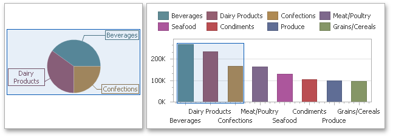
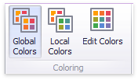
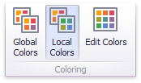

# Coloring Concepts
The Dashboard Designer provides you with the capability to color dashboard item elements by associating dimension values/measures and specified colors. You can choose whether to use a global color scheme to provide consistent colors for identical values or specify a local color scheme for each dashboard item.
* [Supported Dashboard Items](#supporteditems)
* [Color Schemes](#color-schemes)
* [Coloring Dimensions and Measures](#coloring-dimensions-and-measures)

## <a name="supporteditems"/>Supported Dashboard Items
DevExpress Dashboard allows you to manage coloring for the following dashboard items.
* [Chart](../../designing-dashboard-items/chart.md)
* [Scatter Chart](../../designing-dashboard-items/scatter-chart.md)
* [Pie](../../designing-dashboard-items/pies.md)
* [Pie Map](../../designing-dashboard-items/geo-point-maps/pie-map.md)
* [Range Filter](../../designing-dashboard-items/range-filter.md)
* [Treemap](../../designing-dashboard-items/treemap.md)

## <a name="color-schemes"/>Color Schemes
The dashboard provides two ways of coloring dashboard item elements.
* Using a global color scheme that provides consistent colors for identical values across the dashboard. The image below shows the dashboard containing Pie and Chart dashboard items. Pie segments and chart series points corresponding to 'Beverages', 'Condiments' and 'Diary Products' dimension values are colored using identical colors from the default palette.
	
	
	
	To use global colors for coloring dashboard item elements, click the **Global Colors** button in the **Design** ribbon tab.
	
	
	
	> When a global color scheme is used, the dashboard reserves automatically generated colors for certain values regardless of the filter state.
* Using a local color scheme that provides an independent set of colors for each dashboard item.
	
	To use local colors for coloring dashboard item elements, click **Local Colors** in the **Design** ribbon tab.
	
	
	
	> When a local color scheme is used, the dashboard reassigns palette colors when the filter state is changed.

## <a name="coloring-dimensions-and-measures"/>Coloring Dimensions and Measures
Dashboard items allow you to manage the coloring of individual dimensions or all dashboard item measures using predefined coloring modes.

| Coloring Mode | Description |
|---|---|
| Default | Dimension values/measures are colored by default. To learn how specific dashboard items color their elements by default, see the **Coloring** topic for the corresponding dashboard item. |
| Hue | Dimension values/measures are colored by hue. If coloring by hue is enabled, a data item indicates this using the  indicator. |
| None | Dimension values/measures are colored with the same color. |

### Coloring Dimension Values

To specify the coloring mode for the required dimension, click the dimension's [menu button](../../ui-elements/data-items-pane.md) and use the **Color by** submenu. For instance, the image below shows the Chart dashboard item whose 'Country' dimension is colored by hue.

### Coloring Measures

To specify the coloring mode for dashboard item measures, click the [menu button](../../ui-elements/data-items-pane.md) of any measure and use the **Color by** submenu. For instance, the image below shows the Pie dashboard item whose measures are colored by hue.

If you enabled coloring by hue for several dimensions/measures, all combinations of dimension values/measures will be automatically colored using different colors from the default palette. To learn how to customize these colors, see [Customizing a Color Scheme](customizing-a-color-scheme.md).