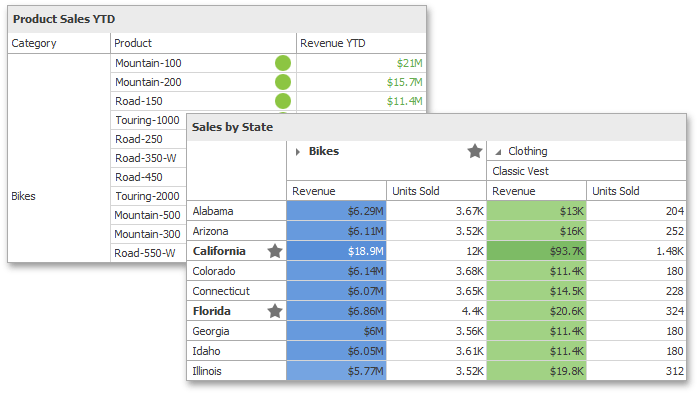
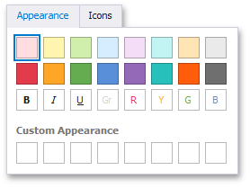
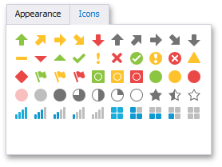
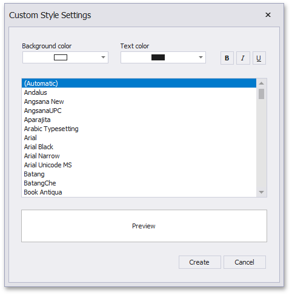
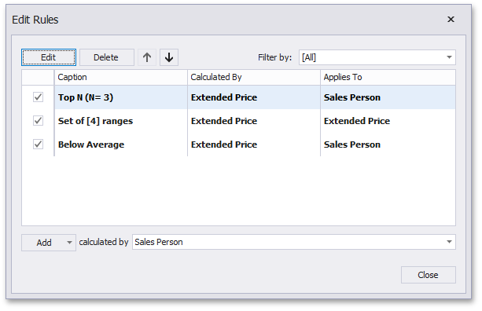

# Conditional Formatting
The Dashboard Designer provides the capability to apply formatting to dashboard item elements whose values meet the specified condition. This feature allows you to highlight specific elements using a predefined set of rules.

To learn more about specifics of using a conditional formatting feature for different dashboard items, see the following topics.
* [Conditional Formatting - Grid](../designing-dashboard-items/grid/conditional-formatting.md)
* [Conditional Formatting - Pivot](../designing-dashboard-items/pivot/conditional-formatting.md)

The current topic describes the following common concepts.
* [Conditional Formatting Overview](#conditional-formatting-overview)
* [Create a Format Rule](#create-a-format-rule)
* [Specify Appearance Settings](#specify-appearance-settings)
* [Edit a Format Rule](#edit-a-format-rule)

## <a name="conditional-formatting-overview"/>Conditional Formatting Overview
Comparison rules used in conditional formatting can be divided into the following groups.
* [Value](conditional-formatting/value.md) - Allows you to compare static values (such as Greater Than, Less Than, Between, etc.).
* [Top-Bottom](conditional-formatting/top-bottom.md) - Highlights a specific number of topmost/bottommost values.
* [Average](conditional-formatting/average.md) - Highlights values above the average value or below the average value.
* [A Date Occurring](conditional-formatting/a-date-occurring.md) - Allows you to highlight date-time values that fall into a specified interval.
* [Expression](conditional-formatting/expression.md) - Allows you to use complex conditions to apply formatting. You can also pass dashboard parameters to expressions.
* [Icon Ranges](conditional-formatting/icon-ranges.md) - Allows you to apply formatting by displaying specific icons for different ranges of values. You can select a predefined set of icons or use a specific icon for each range.
* [Color Ranges](conditional-formatting/color-ranges.md) - Allows you to apply formatting using specific colors for different ranges of values. You can select a predefined set of colors or use custom appearance settings to highlight values within specified ranges.
* [Gradient Ranges](conditional-formatting/gradient-ranges.md) - Allows you to apply formatting using gradient color scales.
* [Bar](conditional-formatting/bar.md) - Allows you to visualize numeric values using bars. You can also color bars corresponding to positive and negative values using different colors.
* [Bar Color Ranges](conditional-formatting/bar-color-ranges.md) - Allows you to visualize numeric values using bars whose colors are contained in the specified color set.
* [Bar Gradient Ranges](conditional-formatting/bar-gradient-ranges.md) - Allows you to visualize numeric values using bars whose colors are contained in the specified color gradient.

You can create comparison rules for [measures or dimensions](../binding-dashboard-items-to-data/binding-dashboard-items-to-data.md). The list below shows format conditions that can be applied to different types of data items.
* Measure/numeric Dimension
	* [Value](conditional-formatting/value.md)
	* [Top-Bottom](conditional-formatting/top-bottom.md)
	* [Average](conditional-formatting/average.md)
	* [Expression](conditional-formatting/expression.md)
	* [Icon Ranges](conditional-formatting/icon-ranges.md)
	* [Color Ranges](conditional-formatting/color-ranges.md)
	* [Gradient Ranges](conditional-formatting/gradient-ranges.md)
	* [Bar](conditional-formatting/bar.md)
	* [Bar Color Ranges](conditional-formatting/bar-color-ranges.md)
	* [Bar Gradient Ranges](conditional-formatting/bar-gradient-ranges.md)
* string Dimension
	* [Value](conditional-formatting/value.md) with the condition type set to _Equal To_, _Not Equal To_ or _Text that Contains_
	* [Expression](conditional-formatting/expression.md)
* date-time Dimension
	* [Value](conditional-formatting/value.md)
	* [A Date Occuring](conditional-formatting/value.md) for dimensions with the continuous date-time group interval
	* [Expression](conditional-formatting/expression.md)
	* [Icon Ranges](conditional-formatting/icon-ranges.md)
	* [Color Ranges](conditional-formatting/color-ranges.md)
	* [Gradient Ranges](conditional-formatting/gradient-ranges.md)
	* [Bar](conditional-formatting/bar.md)
	* [Bar Color Ranges](conditional-formatting/bar-color-ranges.md)
	* [Bar Gradient Ranges](conditional-formatting/bar-gradient-ranges.md)

## <a name="create-a-format-rule"/>Create a Format Rule
To create a new rule used to apply formatting according to the required condition, do the following.
1. Choose a measure/dimension by whose values a format condition will be calculated. Click the measure/dimension menu button, select **Add Format Rule** and choose the condition.
	
	
2. This invokes the dialog that depends on the selected format condition and the type of dashboard item. For instance, the image below displays the **Greater Than** dialog corresponding to the [Value](conditional-formatting/value.md) format condition for the [Grid](../designing-dashboard-items/grid.md) dashboard item.
	
	
	
	In this dialog, specify settings specific for the selected condition (for instance, specify a value to compare with dimension/measure values). To learn more, see the documentation for the required condition.
3. Specify [appearance settings](#specify-appearance-settings) applied to elements whose values meet the specified condition.
4. Specify the data item to whose values conditional formatting is applied using the **Apply to** combo box. Thus, you can create a format rule for one data item and apply new appearance settings to the other data item. You can also create format rules for [hidden measures](../binding-dashboard-items-to-data/hidden-data-items.md) and apply formatting to values of visible data items.
	
	> Different dashboard items can provide additional capabilities for creating a new format rule. To learn more, refer to documentation for the required dashboard item.

## <a name="specify-appearance-settings"/>Specify Appearance Settings
When creating a new format rule, you can select the required appearance settings applied according to the current format condition. All format conditions allow you to customize appearance settings in a similar manner. For instance, the [Value](conditional-formatting/value.md) format condition allows you to specify appearance settings in the following way:
* The **Appearance** tab allows you to choose the predefined background color/font.
	
	
* The **Icons** tab allows you to add the predefined icon.
	
	
* Use the **Custom Appearance** area in the **Appearance** tab to add presets containing custom appearance settings. To add a new preset, click an empty square. This invokes the **Custom Style Settings** dialog, allowing you to specify the required appearance settings.
	
	
	
	In this dialog, you can specify the backgoround/foreground colors and font settings. Click **Create** to add a preset. The created preset will be displayed in the **Custom Appearance** area.

## <a name="edit-a-format-rule"/>Edit a Format Rule
To edit format rules for the selected dashboard item, click the **Edit Rules** button in the **Home** ribbon tab.

As an alternative, use the **Edit Rules** data item's menu item or the corresponding item in the dashboard item's context menu.

This invokes the **Edit Rules** dialog containing existing format rules for this dashboard item.

This dialog allows you to perform the following actions.
* To edit the selected rule, use the **Edit** button or double-click the required rule.
* To delete the selected rule, use the **Delete** button.
* To reorder format rules, use the **Up** and **Down** buttons (the  and  icon, respectively). Reordering of rules allows you to specify the priority of rules from higher (a bottommost rule) to lower (a topmost rule).
* To enable/disable the required rule, use the corresponding check box on the left column.
* To create a new rule, click the **Add** button and select the required format condition. The **calculated by** combo box allows you to select the measure/dimension by whose values a format rule is applied.
* To filter format rules by the specified data item, use the **Filter by** combo box.

To clear all rules for the specified data item, use the **Clear Rules** button in the data item's context menu.