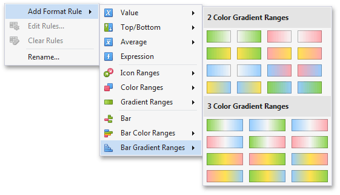
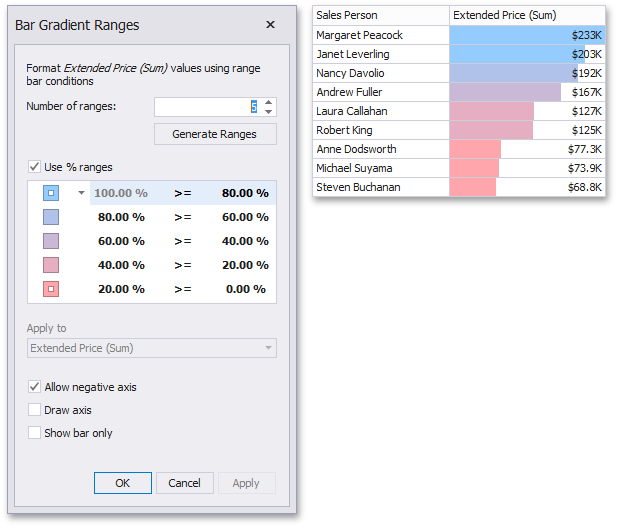
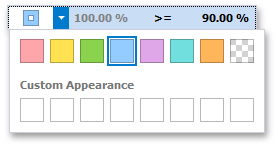

# Bar Gradient Ranges
The Bar Gradient Ranges allow you to visualize numeric values using bars whose colors are contained in the specified color gradient.

To format values according the required condition, click the measure menu button, select **Add Format Rule | Bar Gradient Ranges** and choose the required color gradient.

This invokes the **Bar Gradient Ranges** dialog containing the set of value ranges and corresponding appearance settings. The Grid dashboard item on the right displays the default formatting applied using the predefined Red-Blue gradient.

This dialog allows you to change the following options specific to Bar Gradient Ranges.
* **Number of ranges** allows you to specify the number of ranges used to classify values. Click the **Generate Ranges** button to generate a new gradient scale according to the specified number of ranges.
* The **Use % ranges** check box specifies whether the percent or absolute scale is used to generate ranges.
	
	> Note that this option is not available for numeric dimensions.
* To change the specific color in the gradient, click the button next to the required color and select a new color or specify a custom background color. This allows you to create a color gradient based on more than two colors. In this case, the specified colors are marked with an empty square.
	
	
	
	To learn how to specify a custom color, see the **Specify Appearance Settings** paragraph in the [Conditional Formatting](../conditional-formatting.md) topic.
* You can change range boundaries by specifying the required values.
	
	
	
	> Note that a new value should fall into a range between corresponding values of the previous and next range.
* To change the comparison logic for the required range, click the comparison sign and select the required option.
	
	
	
	The _greater or equal_ sign includes the smallest value in the current interval while the _greater_ sign excludes the smallest value from the current interval and includes it in the next interval.