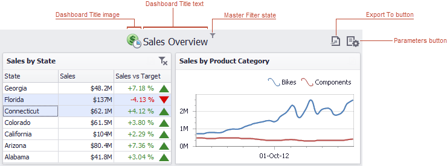
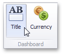
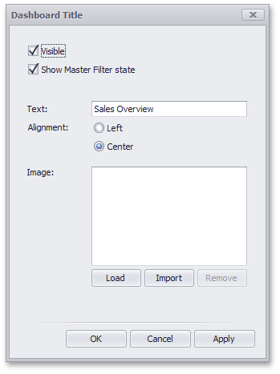

# Dashboard Title
The **Dashboard Title** is located at the top of the dashboard surface. It can contain text or image content.
 

If you are using the Ribbon menu in the **Dashboard Designer**, you can change title settings by clicking the **Title** button.

This invokes the **Dashboard Title** dialog, which allows you to change the text within the dashboard title, add an image, etc.

This dialog allows you to specify the following options.
* **Visible** - Specifies whether or not the dashboard title is visible.
* **Show Master Filter state** - Specifies whether or not to show the state of master filter items in the dashboard title.
	
	When you hover over the filter icon (), all master filters applied to the dashboard are displayed in the invoked popup.
	
	
* **Alignment** - Specifies the alignment of the dashboard title.
* **Load** button - Allows you to specify the image displayed within the dashboard title. In this case, the dashboard definition will contain the URL to access the image.
	
	**Import** button - Allows you to specify the image displayed within the dashboard title. In this case, the dashboard definition will contain an image as a byte array.

The dashboard title can contain command buttons.
* **Export To** button - allows you to print/export the dashboard. To learn more about printing and exporting, see the [Printing and Exporting](../../../../dashboard-for-desktop/articles/dashboard-designer/printing-and-exporting.md) topic.
* **Parameters** button - allows you to modify dashboard parameter values. To learn more about parameters, see the [Using Dashboard Parameters](../../../../dashboard-for-desktop/articles/dashboard-designer/data-analysis/using-dashboard-parameters.md) topic.