# Intermediate Level Aggregations
The Dashboard can aggregate and summarize data on different levels.
* The [Query Builder](../../working-with-data/using-the-query-builder.md) allows you to prepare an underlying data source before analyzing data. You can apply grouping, sorting, summarization and other data shaping operations during data selection.
* [Dashboard items](../../designing-dashboard-items.md) aggregate and summarize data at a visualization level using dimensions and measures, respectively. To learn more, see [Binding Dashboard Items to Data](../../binding-dashboard-items-to-data/binding-dashboard-items-to-data.md).
* The **Aggr** function allows you to introduce an intermediate detail level that is not related to the visualization level. This allows you to create custom aggregations at different levels and combine these aggregations with existing visualizations.

## Overview
The **Aggr** function aggregates and summarizes underlying data using the detail level specified by a predefined set of dimensions and a specified summary function. This function can be used during the creation of a new [calculated field](../../working-with-data/creating-calculated-fields.md) in the Expression Editor.

The **Aggr** function has the following syntax.

**expression**

```expression

Aggr(summaryExpression, dimension1, dimension2, ...)

```

The first argument is a [summary expression](summary-level-aggregations.md) calculated against a specific data source field. The next arguments are the set of dimensions whose values are aggregated and used to calculate summaries specified using the first argument.
For instance, the following function calculates sums of sales for each product within the specified category.

**expression**

```expression

Aggr(Sum([Sales]), [Category], [Product])

```

If you created the calculated field that includes the **Aggr** function and dropped the created field into an existing [dashboard item](../../designing-dashboard-items.md), the Dashboard joins the resulting aggregation with the already displayed data. This means that you can add data with the increased or decreased granularity to the dashboard item. There are two main scenarios.
* In the first scenario, an aggregation has a **less detailed granularity** than visualized data.
	
	In this scenario, an underlying data source contains the list of orders for two categories and corresponding products.
	
	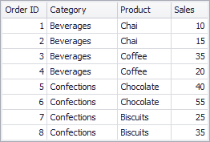
	
	To aggregate this data by individual categories, create a calculated field with the following expression.
	
	**expression**
	
	```expression
	
	Aggr(Sum([Sales]), [Category])
	
	```
	
	The following internal table will be generated for this calculated field.
	
	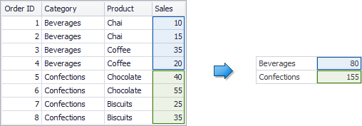
	
	The sample [Grid](../../designing-dashboard-items/grid.md) dashboard item contains more detailed data and includes the following columns: _Category_, _Product_ and the sum of _Sales_.
	
	
	
	If you drop the created calculated field to the Grid, the sum of sales for each category will be repeated for each Grid row.
	
	
	
	For instance, you can use these values later to calculate a contribution of each product to a category’s sales.
* An aggregation has a **more detailed granularity** than visualized data.
	
	To aggregate this data by categories and products, create a calculated field with the following expression.
	
	**expression**
	
	```expression
	
	Aggr(Sum([Sales]), [Category], [Product])
	
	```
	
	The following internal table will be generated for this calculated field.
	
	
	
	Drop the created calculated field to the Grid and set its summary type to **Min**. The Grid will display minimum product sales within each category.
	
	

## Example 1 - Best/Worst Sales by Year
The following example shows how to display best and worst monthly sales for each year.

In this example, the [Chart](../../designing-dashboard-items/chart.md) dashboard item shows the sum of sales by different years. The _Sales_ field is placed in the [Values](../../designing-dashboard-items/chart/providing-data.md) section and the _OrderDate_ (with the **Year** [group interval](../../data-shaping/grouping.md)) is placed in the [Arguments](../../designing-dashboard-items/chart/providing-data.md) section.

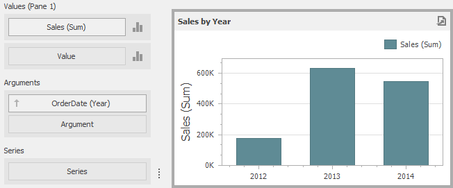

To display sales by the best/worst months for each year, create a new [calculated field](../../working-with-data/creating-calculated-fields.md) with the following expression.

**expression**

```expression

Aggr(Sum([Sales]), GetYear([OrderDate]), GetMonth([OrderDate]))

```

Drop this field (_Sales by Year/Month_ in the image below) to the Values section and set its [summary type](../../data-shaping/summarization.md) to **Max**. Then, drop this field to Values again and set its summary type to **Min**. The Chart will visualize sales by the best/worst months in a year.

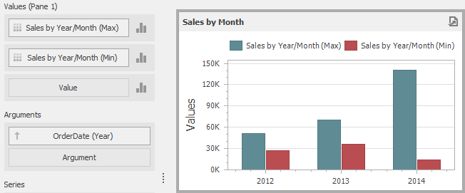

## Example 2 - Percent of Total
This example will demonstrate how to calculate a contribution of individual quarter sales to year sales.

In this example, the [Pivot](../../designing-dashboard-items/pivot.md) dashboard item displays the sum of sales by year/quarter. The _Sales_ field is placed in the [Values](../../designing-dashboard-items/pivot/providing-data.md) section and the hierarchy of _OrderDate_ fields (with the **Year** and **Quarter** [group intervals](../../data-shaping/grouping.md)) is placed in [Rows](../../designing-dashboard-items/pivot/providing-data.md).

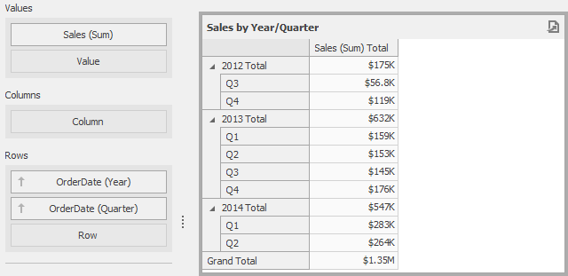

To calculate a contribution of each quarter to a year sales, do the following.
* Calculate totals for each year using the **Aggr** function by creating the following calculated field.
	
	**expression**
	
	```expression
	
	Aggr(Sum([Sales]), GetYear([OrderDate]))
	
	```
	
	Set the name of the created field to _Sales by Year_.
* Calculate a contribution of each quarter to year sales by creating the following calculated field.
	
	**expression**
	
	```expression
	
	Sum([Sales]) / Max([Sales by Year])
	
	```
	
	Name this field _Percent of Total_ and drop it to **Values** to see the result.

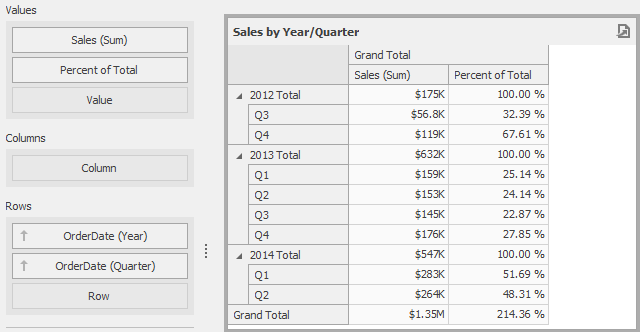

## Example 3 - Customer Acquisition
In this example, a customer acquisition will be evaluated by grouping customers by the quarter/year of their first purchase to compare sales contributions.

The [Chart](../../designing-dashboard-items/chart.md) dashboard item below visualizes sales by quarter/year.

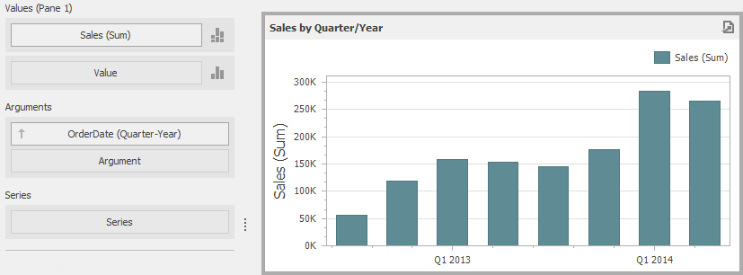

The following expression determines the minimum order date (the first purchase date) per customer.

**expression**

```expression

Aggr(Min(GetDateQuarterYear([OrderDate])), [CustomerID])

```

Set the name of the created field to _Customer First Order_ and drop this field to the **Series** section to see the result.

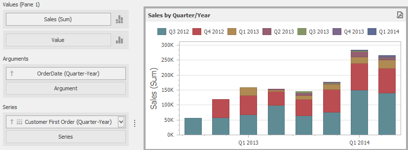

## Example 4 - Customer Order Count
In this example, you will learn how to divide customers count by the number of orders they made.

The Chart below shows the number of orders that is made by each customer.

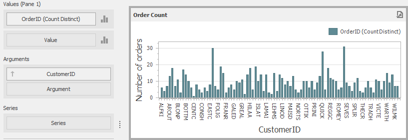

The calculated field below evaluates the number of unique orders made by each customer.

**expression**

```expression

Aggr(CountDistinct([OrderID]), [CustomerID])

```

Set the name of this field to _Customer Order Count_ and drop this field to arguments. Then, drop the _CustomerID_ field to **Values** and change its [summary type](../../data-shaping/summarization.md) to **Count Distinct**.

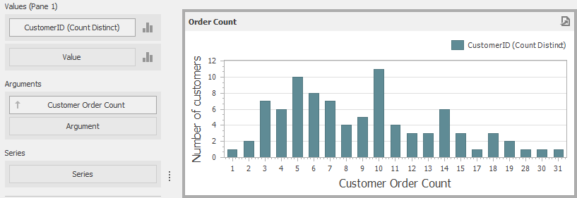

The Chart will show the number of customers that made a specific number of orders.

## Example 5 - Best Product Sales by Year
This scenario requires the use of nested aggregations. In this example, the dashboard will show products with the best sales in a year along with sales values.

The initial [Grid](../../designing-dashboard-items/grid.md) dashboard item shows sales of all products by year (the _OrderDate_ column with the **Year** [group interval](../../data-shaping/grouping.md) and the _Sales_ column). The data source also contains the _ProductName_ field.

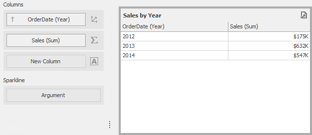

To implement this scenario, perform the following steps.
* Create the calculated field that will return product sales for individual years.
	
	**expression**
	
	```expression
	
	Aggr(Sum([Sales]), GetYear([OrderDate]), [ProductName])
	
	```
	
	Set its name to _Product Sales by Year_.
* Create the calculated field that will return maximum sales values.
	
	**expression**
	
	```expression
	
	Aggr(Max([Product Sales by Year]), GetYear([OrderDate]))
	
	```
	
	Set its name to _Max Product Sales by Year_.
* Finally, create a calculated field returning the name of the product with the best sales and a corresponding sales value.
	
	**expression**
	
	```expression
	
	Iif([Max Product Sales by Year] = [Product Sales by Year], [ProductName] + ' ($ ' + [Product Sales by Year] + ')', null)
	
	```
	
	Specify the name as _Best Sales Product_. Then, drop this field to the **Columns** section to see the result.

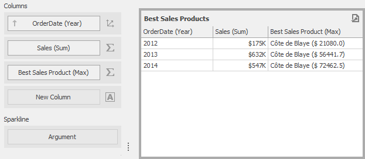