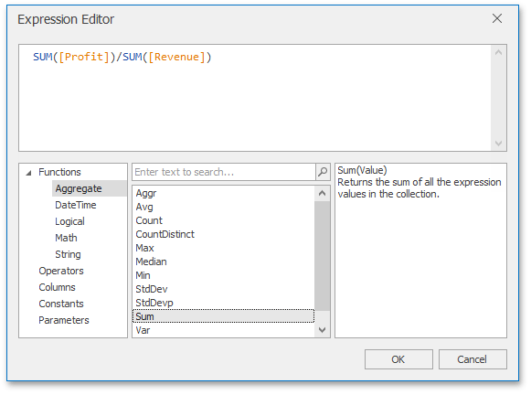

# Summary Level Aggregations
The Dashboard Designer allows you to perform aggregations when constructing a [calculated field expression](../../../../../dashboard-for-desktop/articles/dashboard-designer/working-with-data/creating-calculated-fields.md). This allows you to evaluate calculated fields on a summary level.

In the Dashboard Designer, you can use the following set of predefined aggregate functions.

| Function | Description |
|---|---|
| Aggr(SummaryExpression, Dimensions) | Aggregates underlying data using the detail level specified by a predefined set of dimensions and a specified summary function. To learn more, see [Intermediate Level Aggregations](../../../../../dashboard-for-desktop/articles/dashboard-designer/data-analysis/aggregations/intermediate-level-aggregations.md). |
| Avg(Value) | Returns the average of all the values in the expression. |
| Count() | Returns the number of values. |
| CountDistinct(Value) | Returns the number of distinct values. |
| Max(Value) | Returns the maximum value across all records. |
| Min(Value) | Returns the minimum value across all records. |
| Median(Value) | Returns the median of the values. |
| Sum(Value) | Returns the sum of all values. |
| Var(Value) | Returns an estimate of the variance of a population where the sample is a subset of the entire population. |
| Varp(Value) | Returns the variance of a population where the population is the entire data to be summarized. |
| StdDev(Value) | Returns an estimate of the standard deviation of a population where the sample is a subset of the entire population. |
| StdDevp(Value) | Returns the standard deviation of a population where the population is the entire data to be summarized. |

These functions can be used for all types of numeric fields. After creating such calculated fields, you can use them as measures contained in an OLAP cube.