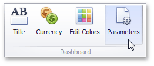
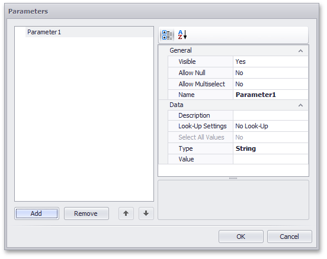
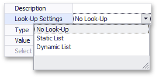
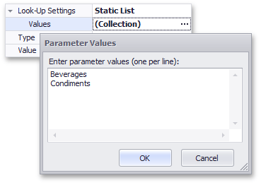
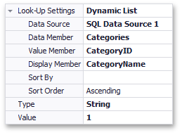

This topic explains how to create a new dashboard parameter and specify its settings.
* [Creating Parameters in the Dashboard Designer](#creating-parameters-in-the-dashboard-designer)
* [Look-Up Editor Settings](#look-up-editor-settings)

## <a name="creating-parameters-in-the-dashboard-designer"/>Creating Parameters in the Dashboard Designer
To create dashboard parameters in the Dashboard Designer, do the following:
1. Click the **Parameters** button on the Ribbon's **Data Source** tab.
	
	
2. In the invoked dialog, click the **Add** button to add a new parameter.
	
	
3. Specify the following settings.
	* **Visible** - Specifies whether or not the parameter editor is visible in the [Dashboard Parameters](../../../../../dashboard-for-desktop/articles/dashboard-designer/data-analysis/using-dashboard-parameters/requesting-parameter-values.md) dialog.
	* **Allow Null** - Specifies whether or a not null value can be passed as a parameter value.
	* **Allow Multiselect** - Specifies whether or not multi-selection is enabled for the current parameter. The following limitations are applied to parameters with multi-selection enabled.
		* Use the **is any of** or **is none of** operators to pass a multi-select parameter to a [filter](../../../../../dashboard-for-desktop/articles/dashboard-designer/data-shaping/filtering.md) criteria or to the [Expression](../../../../../dashboard-for-desktop/articles/dashboard-designer/appearance-customization/conditional-formatting/expression.md) format condition.
		* Use the **In** or **Not In** operators to pass a multi-select parameter to a [calculated field](../../../../../dashboard-for-desktop/articles/dashboard-designer/working-with-data/creating-calculated-fields.md) expression.
		* Stored procedures used in the [SQL](../../../../../dashboard-for-desktop/articles/dashboard-designer/working-with-data/stored-procedures.md) data source do not support multi-select parameters.
	* **Name** - Specifies the parameter name. When creating and modifying parameter names, follow the rules below.
		* A name can contain letters, numbers and underscores.
		* A name cannot contain spaces.
		* A name cannot be an empty string.
		* The dashboard cannot contain parameters with the same name.
		* Names are case-sensitive. For example, you can create the names _Parameter_ and _PARAMETER_ .
	* **Description** - Specifies the parameter's description. The parameter's description is the value displayed in the **Parameter Name** column of the [Dashboard Parameters](../../../../../dashboard-for-desktop/articles/dashboard-designer/data-analysis/using-dashboard-parameters/requesting-parameter-values.md) dialog.
	* **Look-Up Settings**  -  Specifies the parameter's [look-up editor settings](#look-up-editor-settings).
	* **Select All Values** - Specifies whether or not all parameter values should be selected in the initial state of the Dashboard Viewer.
		
		Note that this option is in effect when **Allow Multiselect** is set to **true**.
	* **Type** - Specifies the parameter type.
	* **Value** - Specifies the default parameter’s value. Note that when **Allow Multiselect** is set to **true**, the **Value** option allows you to select multiple parameter values.
	
	Then, click **OK** to add the created parameters to the dashboard.

## <a name="look-up-editor-settings"/>Look-Up Editor Settings
There are three types of look-up editor settings that can be specified for a parameter. Select the required type from the **LookUpSettings** drop-down list.

* **No Look-Up** - set the **Value** to use a static value as a parameter.
	
	
* **Static List** - click the ellipsis button to add static values for the current dashboard parameter.
	
	
	
	In this case, the **Value** specifies the default parameter's value.
* **Dynamic List** - allows you to use a list of values from the existing data source as a parameter. You need to select the required **Data Source** from the list of available data sources and data members for the dashboard parameter's display name and value, respectively.
	
	
	1. First, select the required **Data Source** from the list of available data sources. For the [SQL](../../../../../dashboard-for-desktop/articles/dashboard-designer/providing-data/connecting-to-sql-databases.md) data source, select the required **Data Member** that specifies the query from the selected **Data Source**.
	2. Then, specify data members for the dashboard parameter's value and display name using **Value Member** and **Display Member**, respectively.
	3. If necessary, specify the data member used to sort parameter values using the **Sort By** option. **Sort Order** specifies the required sort order.
	
	> To learn how to create a data source for a dashboard parameter, see [Providing Data](../../../../../dashboard-for-desktop/articles/dashboard-designer/providing-data.md).
	> 
	> Note that you cannot specify an [OLAP](../../../../../dashboard-for-desktop/articles/dashboard-designer/providing-data/connecting-to-olap-cubes.md) data source as the data source for the dashboard parameter in the Dashboard Designer.