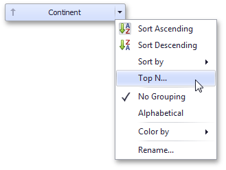
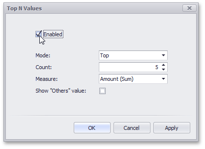

# Top N
The **Top N** feature allows you to display only a limited number of values that correspond to the highest or lowest values of a particular measure.

To display the top values in a dimension, select **Top N** from the data item menu.

This invokes the **Top N Values** dialog.

In this dialog, check the **Enabled** check box and specify the following settings.

| Setting | Description |
|---|---|
| **Mode** | Specifies whether top or bottom values should be displayed. |
| **Count** | The number of values to be displayed. |
| **Measure** | The parameter that will determine the top or bottom value. |
| **Show "Others" value** | If enabled, all values that are not the top/bottom values are consolidated in the "Others" value. |

You can use the [hidden measure](../../../../dashboard-for-desktop/articles/dashboard-designer/binding-dashboard-items-to-data/hidden-data-items.md) as a parameter that will determine the top or bottom value.