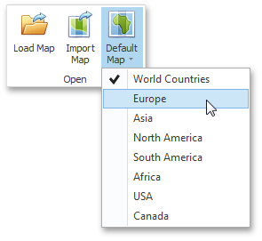
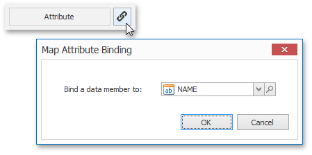
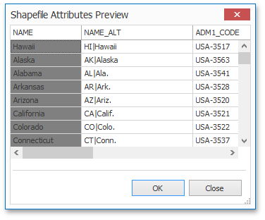

This document explains how to use the default **DevExpress Dashboard maps**, or provide custom maps.

## Default Maps
DevExpress Dashboard ships with a set of default maps showing various parts of the world. The following maps are included.
* **World Countries** - a world map.
* **Europe** - a map of Europe.
* **Asia** - a map of Asia.
* **North America** - a map of North America.
* **South America** - a map of South America.
* **Africa** - a map of Africa.
* **USA** - a map of the USA.
* **Canada** - a map of Canada.

> Note that the **World Countries** map has a lower level of detail than maps of specific regions and may not contain some countries. As an alternative, you can load a custom map with the required granularity.

To select the required default map, use the **Default Map** button in the **Open** group of the **Design** ribbon tab.

As an alternative, use the corresponding command in the map context menu.

## Custom Maps
DevExpress Dashboard uses a **Shapefile** vector format to provide custom maps. Commonly, this format includes two file types.
* **.shp** file - holds map shapes (points/lines/polygons).
* **.dbf** file - contains attributes for each shape.

To open an existing shapefile, use the **Load Map** or **Import Map** button in the Ribbon, or the command in the context menu (**Load Map...** or **Import Map...**).

In the invoked dialog, locate the required **.shp** file. Note that custom maps created in the Cartesian coordinate system are not supported.

> If the map is opened using the **Load Map** button, the [dashboard XML definition](../../../../../dashboard-for-desktop/articles/dashboard-designer/saving-a-dashboard.md) will contain the path to a map shapefile. If the map is opened using the **Import Map** button, the dashboard XML definition will contain the map itself.

> Attributes from the corresponding **.dbf** file located in the same directory will be included in the map automatically.

## Map Attributes
After you select the default map or a custom map, you can view supplemental information (such as the name of the country, state, etc.). To do this, click the **Options** button next to the **Attribute** placeholder.
 

In the invoked **Map Attribute Binding** dialog, click **Preview**.

This table displays the available attributes for the current map. Each set of attribute values is related to a specific map shape.

To learn how to bind the map attribute to a data source field, see the [Providing Data](../../../../../dashboard-for-desktop/articles/dashboard-designer/designing-dashboard-items/choropleth-map/providing-data.md) topic.