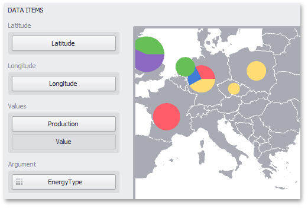

This topic describes how to bind the **Pie Map** dashboard item to data using the **Dashboard Designer**.

The Dashboard Designer allows you to bind various dashboard items to data in a virtually uniform manner (see [Binding Dashboard Items to Data](../../../../../../dashboard-for-desktop/articles/dashboard-designer/binding-dashboard-items-to-data/binding-dashboard-items-to-data.md) for details). The only difference is in the data sections that these dashboard items have.

The image below shows a sample Pie Map dashboard item that is bound to data.

Note that the Pie Map provides two data item groups for data binding: DATA ITEMS and TOOLTIP DATA ITEMS.
Tables below list the available data sections.

**DATA ITEMS**

| Section | Description |
|---|---|
| **Latitude** | Accepts a dimension used to provide geographic latitude. |
| **Longitude** | Accepts a dimension used to provide geographic longitude. |
| **Values** | Accepts measures used to calculate pie values. In case of negative measure values, Pie Map uses their absolute values. If you added a data item to the **Argument** section and several data items to the **Values** section, you  can use the **Values** drop-down menu to switch between the provided values. To invoke the **Values** menu, click the  icon in the map's [caption](../../../../../../dashboard-for-desktop/articles/dashboard-designer/dashboard-layout/dashboard-item-caption.md) or use the map's context menu. |
| **Argument** | Allows you to provide data for pie arguments. |

**TOOLTIP DATA ITEMS**

| Section | Description |
|---|---|
| **Dimensions** | Accepts dimensions allowing you to add supplementary content to the tooltips. |
| **Measures** | Accepts measures allowing you to add summaries to the tooltips. |