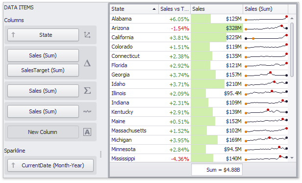

# Providing Data
The Dashboard Designer allows you to bind various dashboard items to data in a virtually uniform manner. To learn more, see the [Binding Dashboard Items to Data](../../binding-dashboard-items-to-data.md) topic.

The only difference is in the data sections that the required dashboard item has. This topic describes how to bind a **Grid** dashboard item to data in the Designer.

The image below shows a sample Grid dashboard item that is bound to data.

To bind the Grid dashboard item to data, drag and drop a data source field to a placeholder contained in one of the available data sections. A table below lists and describes a Grid's data sections.

| Section | Description |
|---|---|
| **Columns** | Contains data items that provide values for grid columns. The _[Options](../../ui-elements/data-items-pane.md)_ button next to the **Column** data item allows you to select the [column type](columns/column-type-overview.md) and specify their options. |
| **Sparkline** | Contains a data item that provides arguments for sparkline columns. To learn more, see [Sparkline Column](columns/sparkline-column.md). |