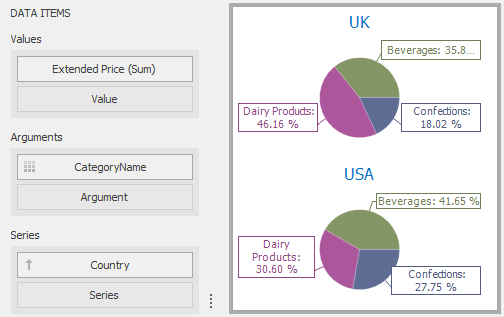
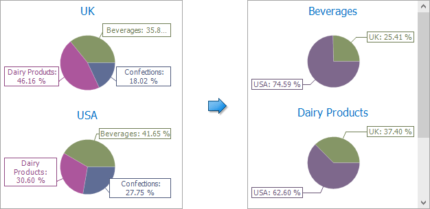

# Providing Data
The Dashboard Designer allows you to bind various dashboard items to data in a virtually uniform manner. To learn more, see the [Binding Dashboard Items to Data](../../../../../dashboard-for-desktop/articles/dashboard-designer/binding-dashboard-items-to-data.md) topic.

The only difference is in the data sections that the required dashboard item has. This topic describes how to bind a **Pie** dashboard item to data in the Designer.
* [Binding to Data in the Designer](#bindingdesigner)
* [Transposing Arguments and Series](#transposing)

## <a name="bindingdesigner"/>Binding to Data in the Designer
The image below shows a sample Pie dashboard item that is bound to data.

To bind the Pie dashboard item to data, drag and drop a data source field to a placeholder contained in one of the available data sections. A table below lists and describes Pie's data sections.

| Section | Description |
|---|---|
| **Values** | Contains data items that define the share of pie segments. In case of negative measure values, Pie uses their absolute values. |
| **Arguments** | Contains data items that provide values used to label pie segments. |
| **Series** | Contains data items whose values are used to label pie charts. |

## <a name="transposing"/>Transposing Arguments and Series
The Pie dashboard item provides the capability to transpose pie arguments and series. In this case, data items contained in the **Arguments** section are moved to the **Series** section, and vice versa.

To transpose the selected Pie dashboard item, use the **Transpose** button in the **Home** ribbon tab.

