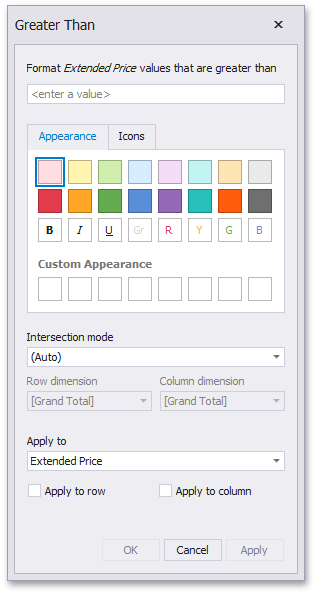

# Conditional Formatting
The Pivot dashboard item supports the conditional formatting feature that provides the capability to apply formatting to cells whose values meet the specified condition. This feature allows you to highlight specific cells or entire rows/columns using a predefined set of rules. To learn more about conditional formatting concepts common for all dashboard items, see the [Conditional Formatting](../../../../../dashboard-for-desktop/articles/dashboard-designer/appearance-customization/conditional-formatting.md) topic.
* [Conditional Formatting Overview](#conditional-formatting-overview)
* [Create a Format Rule](#create-a-format-rule)
* [Edit a Format Rule](#edit-a-format-rule)

## <a name="conditional-formatting-overview"/>Conditional Formatting Overview
The Pivot dashboard item allows you to use conditional formatting to measures placed in the **Values** section and dimensions placed in the **Columns/Rows** sections.

> Note that you can use [hidden measures](../../../../../dashboard-for-desktop/articles/dashboard-designer/binding-dashboard-items-to-data/hidden-data-items.md) to specify a condition used to apply formatting to visible values.

New appearance settings are applied to pivot data cell or cells corresponding to column/row field values.

## <a name="create-a-format-rule"/>Create a Format Rule
To create a new format rule for the Pivot's dimension/measure, do one of the following.
* Click the **Options** button next to the required measure/dimension, select **Add Format Rule** and choose the condition.
* Use the [Edit Rules](#edit-a-format-rule) dialog.

Depending on the selected format condition, the dialog used to create a format rule for Pivot contains different settings.
For instance, the image below displays the [Greater Than](../../../../../dashboard-for-desktop/articles/dashboard-designer/appearance-customization/conditional-formatting/value.md) dialog invoked for the measure.

This dialog contains the following settings specific to Pivot.
* **Intersection mode** specifies the level on which to apply conditional formatting to pivot cells. The following levels are supported.
	1. _Auto_ - Identifies the default level. For the Pivot dashboard item, _Auto_ identifies the _First Level_.
	2. _First Level_ -  First level values are used to apply conditional formatting.
	3. _Last Level_ -  The last level values are used to apply conditional formatting.
	4. _All Levels_ -  All pivot data cells are used to apply conditional formatting.
	5. _Specific Level_ - Values from the specific level are used to apply conditional formatting.
* If you specified the **Intersection mode** as _Specific Level_, use the **Row dimension** and **Column dimension** combo boxes to set the specific level.
* The **Apply to row** and **Apply to column** check boxes allow you to specify whether to apply the formatting to the entire pivot row/column.

> If you are creating a new format rule for the dimension from the **Columns/Rows** section, the corresponding format condition dialog would not contain any Pivot specific settings.

## <a name="edit-a-format-rule"/>Edit a Format Rule
To edit format rules for the current Grid dashboard item, use the following options.
* Click the **Edit Rules** button in the **Home** ribbon tab or use corresponding item in the Pivot context menu.
* Click the [menu button](../../../../../dashboard-for-desktop/articles/dashboard-designer/ui-elements/data-items-pane.md) for the required data item and select **Edit Rules**.

All of these actions invoke the **Edit Rules** dialog containing existing format rules. To learn more, see [Conditional Formatting](../../../../../dashboard-for-desktop/articles/dashboard-designer/appearance-customization/conditional-formatting.md).