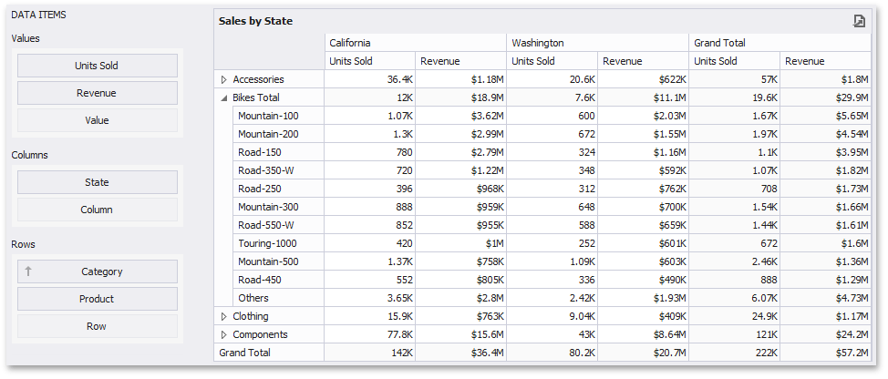
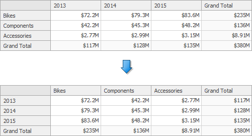

# Providing Data
The Dashboard Designer allows you to bind various dashboard items to data in a virtually uniform manner. To learn more, see the [Binding Dashboard Items to Data](../../binding-dashboard-items-to-data.md) topic.

The only difference is in the data sections that the required dashboard item has. This topic describes how to bind a **Pivot** dashboard item to data in the Designer.
* [Binding to Data in the Designer](#bindingdesigner)
* [Transposing Columns and Rows](#transposing)

## <a name="bindingdesigner"/>Binding to Data in the Designer
The image below shows a sample Pivot dashboard item that is bound to data.

To bind the Pivot dashboard item to data, drag and drop a data source field to a placeholder contained in one of the available data sections. A table below lists and describes a Pivot's data sections.

| Section | Description |
|---|---|
| **Values** | Contains data items used to calculate values displayed in the pivot table. |
| **Columns** | Contains data items whose values are used to label columns. |
| **Rows** | Contains data items whose values are used to label rows. |

## <a name="transposing"/>Transposing Columns and Rows
The **Pivot** dashboard item provides the capability to transpose pivot columns and rows. In this case, data items contained in the Columns section are moved to the Rows section and vice versa.

To transpose the selected Pivot dashboard item, use the **Transpose** button in the **Home** ribbon tab.

