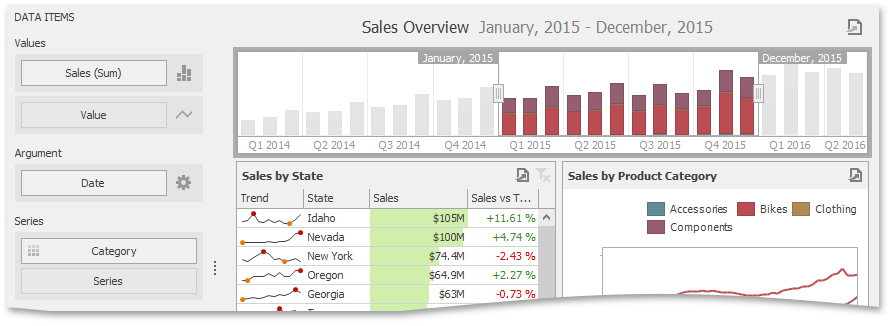

The Dashboard Designer allows you to bind various dashboard items to data in a virtually uniform manner. To learn more, see the [Binding Dashboard Items to Data](../../../../../dashboard-for-desktop/articles/dashboard-designer/binding-dashboard-items-to-data.md) topic.

The only difference is in the data sections that the required dashboard item has. This topic describes how to bind a **Range Filter** dashboard item to data in the Designer.

The image below shows a sample Range Filter dashboard item that is bound to data.

To bind the Range Filter dashboard item to data, drag and drop a data source field to a placeholder contained in one of the available data sections. A table below lists and describes Range Filter data sections.

| Section | Description |
|---|---|
| **Values** | Contains data items against which the Y-coordinates of data points are calculated. |
| **Argument** | Contains a data item that provides values displayed along the horizontal axis of the Range Filter. [Filtering](../../../../../dashboard-for-desktop/articles/dashboard-designer/designing-dashboard-items/range-filter/interactivity.md) is performed based on these values. Note that the _[Options](../../../../../dashboard-for-desktop/articles/dashboard-designer/ui-elements/data-items-pane.md)_ button (the  icon) allows you to create _[predefined ranges](../../../../../dashboard-for-desktop/articles/dashboard-designer/designing-dashboard-items/range-filter/predefined-ranges.md)_ used to select the required date-time interval. |
| **Series** | Contains data items whose values are used to create chart series. |