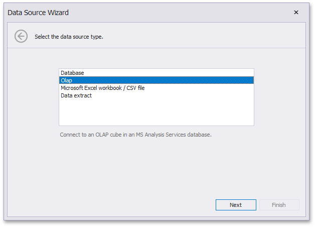
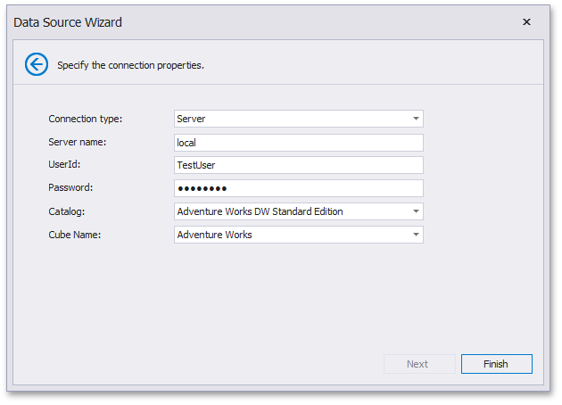
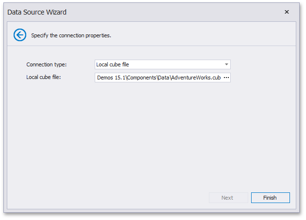
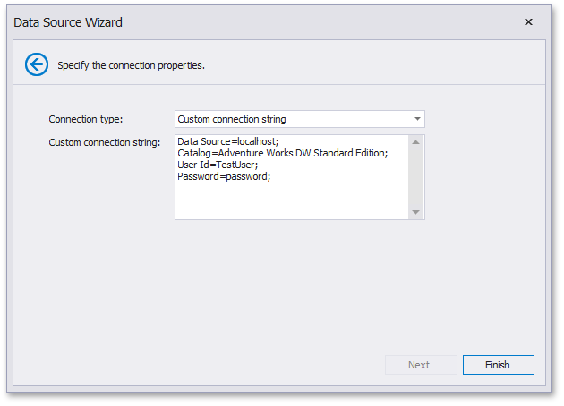

The Dashboard Designer provides the capability to connect to an OLAP cube in the Microsoft Analysis Services database using the **Data Source** wizard.

To connect to an OLAP cube in the Dashboard Designer, do the following steps.
1. Click the **New Data Source** button in the **Data Source** ribbon tab.
	
	
2. On the first page of the invoked **Data Source Wizard** dialog, select **Olap** and click **Next**.
	
	
3. On the next page, choose the required **Connection type**. The following types are available.
	* [Server](#server)
	* [Local cube file](#local-cube-file)
	* [Custom connection string](#custom-connection-string)

## <a name="server"/>Server
If you selected **Server**, the following options are available.

* **Server name**
	
	Specify the name of the OLAP server to which the connection should be established.
* **UserId**
	
	Specify the user name used to authenticate to the OLAP server.
* **Password**
	
	Specify the password used to authenticate to the OLAP server.
* **Catalog**
	
	Select a data catalog that contains cubes.
* **Cube Name**
	
	Select a cube that provides OLAP data.

Click **Finish** to create a data source.

## <a name="local-cube-file"/>Local Cube File
If you selected **Local cube file**, specify the path to the requiredOLAP cube. To locate the cube, click the ellipsis button next to the Database field.

Click **Finish** to create a data source.

## <a name="custom-connection-string"/>Custom Connection String
If you selected **Custom connection string**, specify a connection string in the **Custom connection string** editor.

Click **Finish** to create a data source.