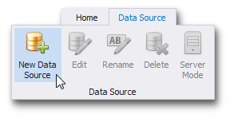
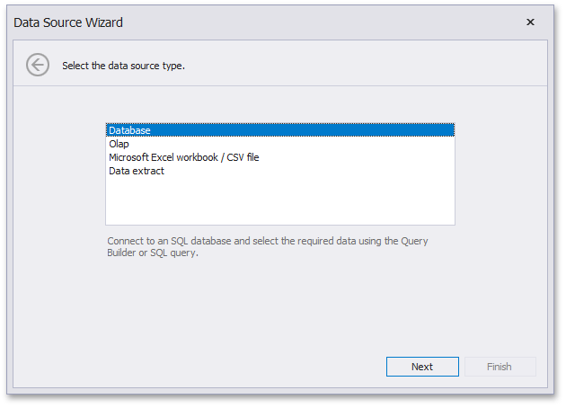
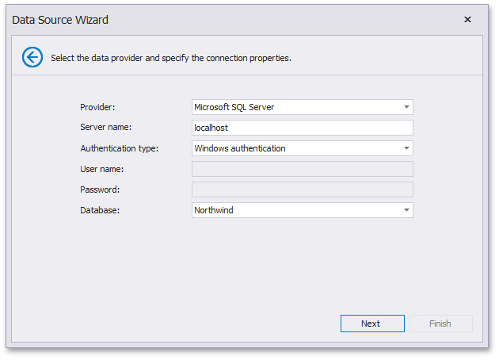
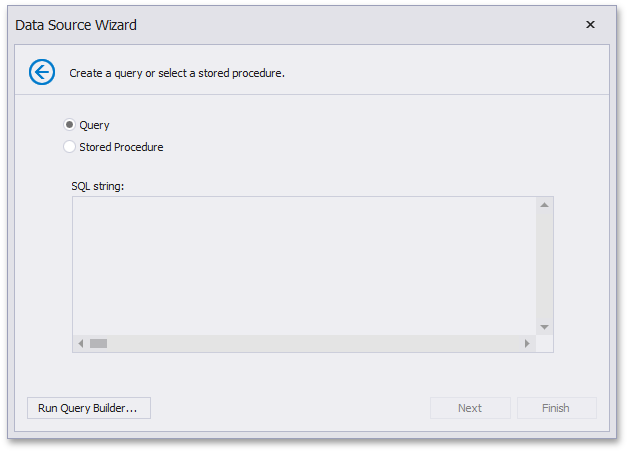
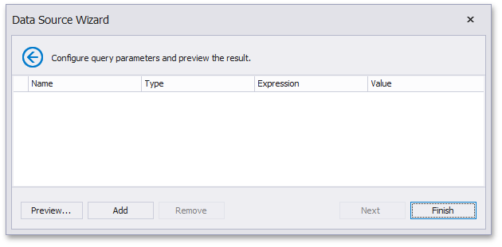

The Dashboard Designer provides the capability to connect to multiple types of SQL databases using the **Data Source** wizard. This tutorial describes how to establish a connection to any supported database and select the required data.

To connect to an SQL database in the Dashboard Designer, follow the steps below.
1. Click the **New Data Source** button in the **Data Source** ribbon tab.
	
	
2. On the first page of the invoked **Data Source Wizard** dialog, select **Database** and click **Next**.
	
	
3. On the next page, select the required data provider and specify the required connection parameters.
	
	
	
	For instance, if you selected the **Microsoft SQL Server** data provider, the following options should be specified.
	* **Server name**
		
		Specify the name of the MS SQL server to which the connection should be established.
	* **Authentication type**
		
		Specify the authentication mode of the MS SQL Server. You can choose whether to use _Windows authentication_ or _Server authentication_.
	* **User name**
		
		Specify the user name used to authenticate to the MS SQL server.
	* **Password**
		
		Specify the password used to authenticate to the MS SQL server.
	* **Database**
		
		Select the database that contains required data.
4. After you have specified the required connection parameters, click **Next** and specify how to select data from the database.
	
	
	* Select the **Query** option and run the [Query Builder](../../../../dashboard-for-desktop/articles/dashboard-designer/working-with-data/using-the-query-builder.md) by clicking the **Run Query Builder...** button. The Query Builder allows you to choose the required tables/columns visually and passes the resulting SQL query to the **SQL String** editor. Click **Finish** to create the data source.
	* Select the **Stored Procedure** option to select one of the [stored procedure](../../../../dashboard-for-desktop/articles/dashboard-designer/working-with-data/stored-procedures.md)s from the database.
	
	Click **Next**.
5. On the final page, you can optionally add [query parameters](../../../../dashboard-for-desktop/articles/dashboard-designer/working-with-data/pass-query-parameters.md) and [preview](../../../../dashboard-for-desktop/articles/dashboard-designer/working-with-data/preview-data.md) data.
	
	
	
	Click **Finish** to create the data source.