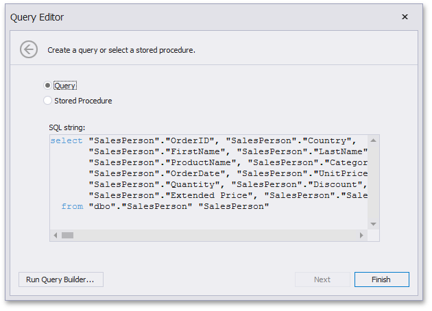
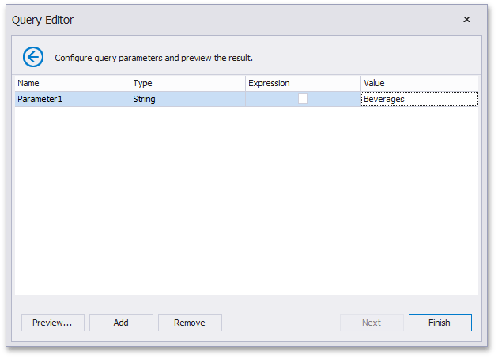

The **Query Editor** dialog allows you to create new SQL queries or edit the existing queries created using the [Data Source](../../../../dashboard-for-desktop/articles/dashboard-designer/providing-data/connecting-to-sql-databases.md) wizard. Optionally, you can add [query parameters](../../../../dashboard-for-desktop/articles/dashboard-designer/working-with-data/pass-query-parameters.md).

The Query Editor can contain two pages depending on the current query.
1. The first page allows you to specify the query or select the [stored procedure](../../../../dashboard-for-desktop/articles/dashboard-designer/working-with-data/stored-procedures.md).
	
	
	
	You can choose the following options to create/modify a query.
	* Select the **Query** option and run the [Query Builder](../../../../dashboard-for-desktop/articles/dashboard-designer/working-with-data/using-the-query-builder.md) by clicking the **Run Query Builder...** button. The Query Builder allows you to choose the required tables/columns visually and displays the resulting SQL query within the **SQL String** editor.
	* If available, select the **Stored Procedure** option to select one of the [stored procedures](../../../../dashboard-for-desktop/articles/dashboard-designer/working-with-data/stored-procedures.md) from the database.
2. The second page of the Query Editor allows you to add or modify [query parameters](../../../../dashboard-for-desktop/articles/dashboard-designer/working-with-data/pass-query-parameters.md).
	
	