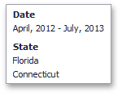
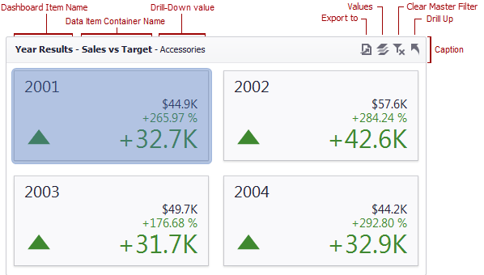

# Dashboard Layout
This topic describes the features related to the dashboard layout.
* [Dashboard Title](#dashboard-title)
* [Dashboard Item Caption](#dashboard-item-caption)
* [Resizing Dashboard Items](#resizing-dashboard-items)

## <a name="dashboard-title"/>Dashboard Title
The **Dashboard Title** is located at the top of the **Dashboard**. The dashboard title can contain text or image content, elements selected in the master filter item and command buttons.

When you hover over the filter icon (), all master filters applied to the dashboard are displayed in the invoked popup.

The dashboard title can contain the following command buttons.
* **Export To** button (the  icon) - allows you to print/export the dashboard. To learn more about printing and exporting, see the [Printing and Exporting](../../../../dashboard-for-desktop/articles/dashboard-viewer/printing-and-exporting.md) topic.
* **Parameters** button (the  icon) - allows you to modify dashboard parameter values. To learn how to modify dashboard parameter values, see the [Requesting Parameter Values](../../../../dashboard-for-desktop/articles/dashboard-viewer/dashboard-parameters/requesting-parameter-values.md) topic.

## <a name="dashboard-item-caption"/>Dashboard Item Caption
Each [dashboard item](../../../../dashboard-for-desktop/articles/dashboard-viewer/dashboard-items.md) has a caption that is displayed at the top of this item. The caption contains static text along with other information, as well as command buttons.

The caption of the Dashboard item contains the following information and buttons, depending on the dashboard item type:
* **Dashboard Item Name** - represents the static text within a dashboard item's caption.
* **Data Item Container Name** - represents the name of the data item container.
* **Drill-Down** value - shows value(s) from the current drill-down hierarchy. To learn more, see the [Drill-Down](../../../../dashboard-for-desktop/articles/dashboard-viewer/data-presentation/drill-down.md) topic.
* **Export to** button - allows you to print or export a dashboard item. To learn how to print individual dashboard items, see the [Printing and Exporting](../../../../dashboard-for-desktop/articles/dashboard-viewer/printing-and-exporting.md) topic.
* **Values** button - invokes a drop-down menu that allows you to switch between provided values (in the pie, card, gauge and map dashboard items). To learn more, see the **Data Presentation Basics** topic for the corresponding dashboard item.
* **Clear Master Filter** button - allows you to reset filtering when a dashboard item acts as the [Master Filter](../../../../dashboard-for-desktop/articles/dashboard-viewer/data-presentation/master-filtering.md). To learn more, see the **Interactivity** topic for the corresponding dashboard item.
* **Drill Up** button - allows you to return to the previous detail level when the [drill-down](../../../../dashboard-for-desktop/articles/dashboard-viewer/data-presentation/drill-down.md) capability is enabled for this item. To learn more, see the **Interactivity** topic for the corresponding dashboard item.

## <a name="resizing-dashboard-items"/>Resizing Dashboard Items
The Dashboard Viewer provides the capability to resize dashboard items.

You can resize individual items (or a group of items) by dragging their edges.