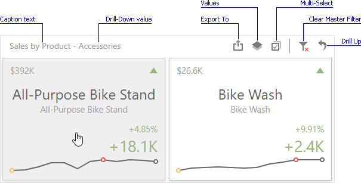
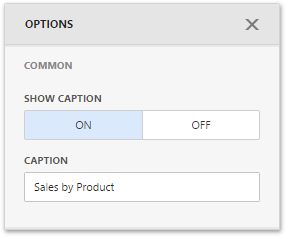

# Dashboard Item Caption

Each dashboard item has a caption that is displayed at the top of this item. The caption contains static text and other information, as well as command buttons.

## Caption Overview

You can control the dashboard item caption's visibility.

* When the caption is **on**, it is always displayed at the top of the dashboard item. Some command buttons are displayed when you hover the mouse pointer over them.
* When the caption is **off**, it is not visible by default. Some command buttons are displayed in a floating panel when you hover the mouse pointer over them. 

Go to the dashboard item [Options](xref:117446) menu and use the **Show Caption** option to control the caption visibility:

> [!NOTE]
> The [Range Filter](../designing-dashboard-items/range-filter.md) dashboard item's caption is not visible by default.

The dashboard item caption consists of the following elements:

 | Icon | Button | Description |
 |---|---|---|
 |  | **Data Reducing** icon | Shows that visible data is limited. |
 | Text  | **Drill-Down Text** | Shows a value or values from the current drill-down hierarchy. See [Drill-Down](../interactivity/drill-down.md) for more details.
 | Text | **Caption Text** | A static text. |
 |  | **Maximize** button | Expands any dashboard item into the whole dashboard size to examine data in greater detail. |
 |  | **Restore** button | Restores the expanded item to its initial state. |
 |  | **Export to** button | Allows you to print or export a dashboard item. To learn how to print individual dashboard items, see [Exporting](../exporting.md). |
 |  | **Values** button | Invokes a drop-down menu that allows you to switch between provided values (in the pie, card, gauge and maps dashboard items). To learn more, see the **Providing Data** topic for the corresponding [dashboard item](../designing-dashboard-items.md). |
 |  | **Multi-Select** button | Allows you to filter data by selecting multiple elements in dashboard items. |
 |  | **Select Date Time Period** menu / button | Allows you to select date-time periods for the Range Filter. |
 |  | **Filters** button  | Displays filters affecting the current dashboard item or entire dashboard. This button is only available in mobile layout. |
 |  | **Clear Master Filter** button | Allows you to reset filtering when a dashboard item acts as the Master Filter. To learn more, see [Master Filtering](../interactivity/master-filtering.md). |
 |  | **Drill Up** button | Allows you to return to the previous detail level when this item's  [drill-down](../interactivity/drill-down.md) capability is enabled. |
 |  | **Clear Selection** button | Allows you to clear the selection inside an item. |
 |  | **Initial Extent** button | Restores the Map dashboard items' default size and position.|
 | Dashboards | **Dashboards** button | Displays a list of available dashboards. |
 |  | **Back** button | Returns to the dashboard items list.| 