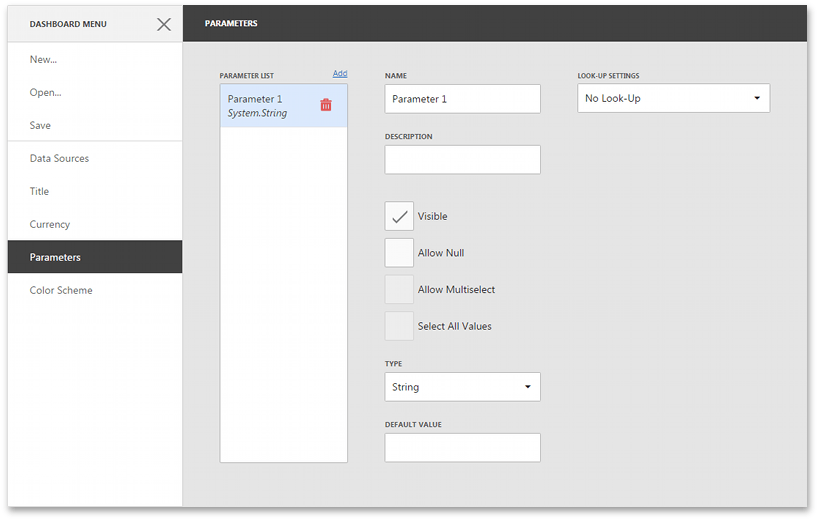

# Creating Parameters
To create a dashboard parameter in the Web Dashboard, perform the following steps.
1. Invoke the [Dashboard Menu](../../../../../dashboard-for-web/articles/web-dashboard-designer-mode/ui-elements/dashboard-menu.md) and select **Parameters**.
2. In the **Parameter List**, click the **Add New Parameter** button. The following settings will be displayed for the created parameter.
	
	
3. Specify the following parameter's settings.
	* **Name** - Specifies the parameter name.
	* **Description** - Specifies the parameter's description. 
		
		The parameter's description is the value displayed in the **Parameter Name** column of the [Dashboard Parameters](requesting-parameter-values.md) dialog.
	* **Visible** - Specifies whether or not the parameter is visible in the [Dashboard Parameters](requesting-parameter-values.md) dialog.
	* **Allow Null** - Specifies whether or a not null value can be passed as a parameter value.
	* **Allow Multiselect** - Specifies whether or not multi-selection is enabled for the current parameter.
	* **Select All Values** - Specifies whether or not all parameter values should be selected in the initial state. Note that this option is in effect when **Allow Multiselect** is set to **true**.
	* **Type** - Specifies the parameter type.
	* **Default Value** - Specifies the default parameter’s value.
	* **Look-Up Settings** - Specifies the parameter's look-up editor settings. To learn more, see the next step.
4. Depending on the selected **Look-up Settings** option, you need to specify the following settings.
	* **No Look-Up** - 
		Allows you to specify the required parameter value manually in the [Dashboard Parameters](requesting-parameter-values.md) dialog.
	* **Static List** - 
		Allows you to select a parameter value defined in a static list. To add predefined parameter values, use the **+** button.
	* **Dynamic List** - 
		Allows you to select a parameter value defined in a data source. To provide access to data source values, specify the following options.
		1. First, select the required **Data Source** from the list of available data sources. For the SQL data source, select the required **Data Member** that specifies the query/data member from the selected **Data Source**.
		2. Then, specify data members for the dashboard parameter's value and display name using **Value Member** and **Display Member**, respectively.
		3. If necessary, specify the data member used to sort parameter values using the **Sort By** option. The **Sort Order** specifies the required sort order.
