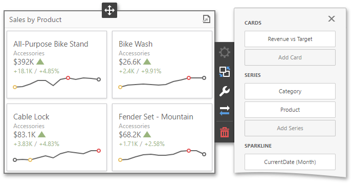

# Providing Data
The **Web Dashboard** allows you to bind various dashboard items to data in a virtually uniform manner. To learn more, see the [Binding Dashboard Items to Data](../../../../../dashboard-for-web/articles/web-dashboard-designer-mode/binding-dashboard-items-to-data.md) topic.

The only difference is in the data sections that the required dashboard item has. This topic describes how to bind a **Card** dashboard item to data.

## Binding to Data in the Web Dashboard
The image below shows a sample Card dashboard item that is bound to data.

To bind the Card dashboard item to data, click a placeholder contained in one of the available data sections and select the required data source field in the **Binding** section of the invoked [data item menu](../../../../../dashboard-for-web/articles/web-dashboard-designer-mode/ui-elements/data-item-menu.md).

The table below lists and describes the Card's data sections.

| Section | Processed as | Description |
|---|---|---|
| **Cards** | Measure  (both _Actual_ and _Target_ values) | Contains data items used to calculate values displayed within cards. After you add the data item containing **actual** data, you can add the second data item (optional) that contains **target** data. If both items are provided, cards show the difference between actual and target values, called _delta_. To learn more, see [Delta](../../../../../dashboard-for-web/articles/web-dashboard-designer-mode/designing-dashboard-items/cards/delta.md). You can fill several data item containers in the Cards section and use the **Values** drop-down menu to switch between the provided values. To invoke the Values menu, click the  icon in the dashboard item caption. |
| **Series** | Dimension | Contains data items whose values are used to label cards. |
| **Sparkline** | Dimension | Provides a date-time dimension whose data will be used to visualize values using [sparklines](../../../../../dashboard-for-web/articles/web-dashboard-designer-mode/designing-dashboard-items/cards/sparkline.md). |