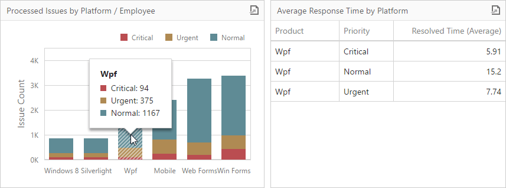
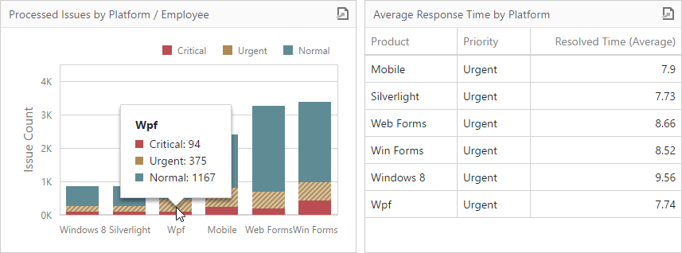
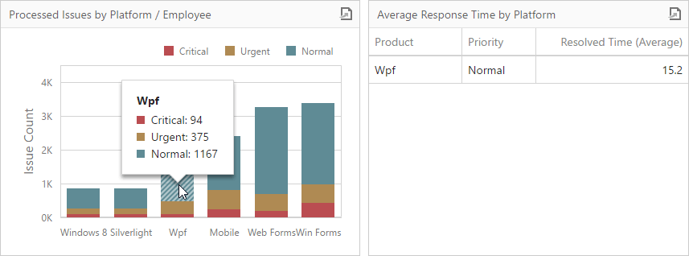
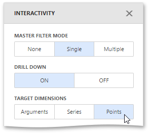
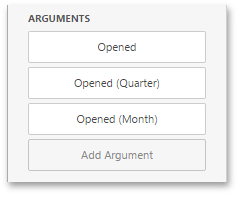
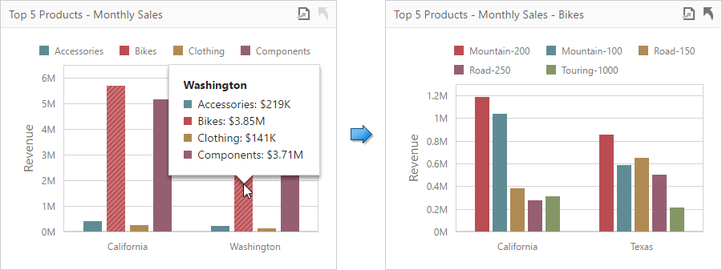
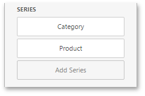

To enable interaction between the Chart and other dashboard items, you can use the interactivity features, as **Master Filtering** and **Drill-Down**.
* [Master Filtering](#masterfiltering)
* [Drill-Down](#drilldown)

## <a name="masterfiltering"/>Master Filtering
You can use the Chart dashboard item as a filter for other dashboard items. To learn more about filtering concepts common to all dashboard items, see the [Master Filtering](../../../../../dashboard-for-web/articles/web-dashboard-designer-mode/interactivity/master-filtering.md) topic.

The Chart supports filtering by **argument**, **series** or **points**.
* Filtering **by arguments** allows you to make other dashboard items display only data related to selected argument values by clicking series points.
	
	
* When filtering **by series** is enabled, you can click a series point to make other dashboard items display only data related to the selected series.
	
	
* Filtering **by points** makes other dashboard items display only data related to the selected point.
	
	

To configure filtering type, open the Chart's [Interactivity](../../../../../dashboard-for-web/articles/web-dashboard-designer-mode/ui-elements/dashboard-item-menu.md) menu and select **Arguments**, **Series** or **Points** as a target dimension.

To reset filtering, use the **Clear Master Filter** button (the  icon) in the Chart's [caption](../../../../../dashboard-for-web/articles/web-dashboard-designer-mode/dashboard-layout/dashboard-item-caption.md).

## <a name="drilldown"/>Drill-Down
The drill-down capability allows you to change the detail level of data displayed in the Chart dashboard item. To learn more about drill-down concepts common to all dashboard items, see the [Drill-Down](../../../../../dashboard-for-web/articles/web-dashboard-designer-mode/interactivity/drill-down.md) topic.

The Chart supports drill-down on **argument** or **series** values.
* To drill down on arguments, click a series point to view a detail chart for the corresponding argument value.
	
	
	
	Drill-down on arguments requires that the Arguments section contains several data items, from the least detailed to the most detailed item.
	
	
* When drill-down on series is enabled, you can click a series point to view a detail chart for the corresponding series.
	
	
	
	Drill-down on series requires that the Series section contains several data items, from the least detailed to the most detailed item.
	
	

> In OLAP mode, you can perform drill-down for either a hierarchy data item or several dimension attributes.

To specify drill-down type, go to the Chart's [Interactivity](../../../../../dashboard-for-web/articles/web-dashboard-designer-mode/ui-elements/dashboard-item-menu.md) menu and set **Arguments** or **Series** as a target dimension.

To return to the previous detail level, click the **Drill Up** button (the  icon) in the Chart's [caption](../../../../../dashboard-for-web/articles/web-dashboard-designer-mode/dashboard-layout/dashboard-item-caption.md).