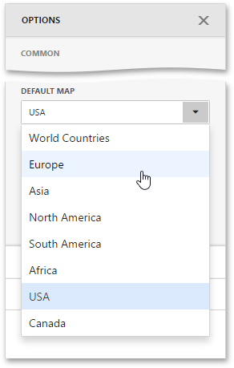
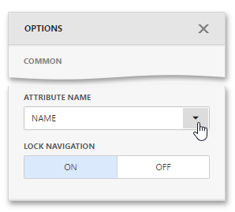

This topic describes how to use the default **DevExpress Dashboard** maps and configure their attributes.
* [Default Maps](#defaultmaps)
* [Custom Maps](#custommaps)
* [Map Attributes](#attributes)

## <a name="defaultmaps"/>Default Maps
The **DevExpress Dashboard** ships with a set of default maps showing various parts of the world. The following maps are included.
* **World Countries** - a map of the world
* **Europe** - a map of Europe
* **Asia** - a map of Asia
* **North America** - a map of North America
* **South America** - a map of South America
* **Africa** - a map of Africa
* **USA** - a map of the USA
* **Canada** - a map of Canada

> The **World Countries** map has a lower level of detail than maps of specific regions and may not contain some of the countries. As an alternative, you can load a custom map with required granularity.

To select a required default map, go to the **Common** section of the [Options](../../../../../dashboard-for-web/articles/web-dashboard-designer-mode/ui-elements/dashboard-item-menu.md) menu and use the **Default Map** dropdown list.

## <a name="custommaps"/>Custom Maps
The Web Dashboard uses a **Shapefile** vector format to provide custom maps. Commonly, this format includes two file types:
* **.shp file** - holds map shapes (points/lines/polygons)
* **.dbf file** - contains attributes for each shape.

To provide a custom map, go to the **Common** section of the [Options](../../../../../dashboard-for-web/articles/web-dashboard-designer-mode/ui-elements/dashboard-item-menu.md) menu and change the **Default Map** value to **Custom**.

Finally, provide shape data using one of the following ways.
* Specify a path to the **.shp** file using the **Custom Map URL** option. Attributes from the corresponding **.dbf** file located in the same directory will automatically be included in the map.
* Load the existing shapefile using the ellipsis button next to the **Custom Map File** option. In the invoked dialog, locate the required **.shp** file. Use the **Custom Attribute File** option to locate the **.dbf** file containing attributes for each shape.

Note that custom maps created in the Cartesian coordinate system are not supported.

## <a name="attributes"/>Map Attributes
After you select the default or custom map, you can display supplementary information (such as the name of a country, state, etc.). To do this, go to the [Options](../../../../../dashboard-for-web/articles/web-dashboard-designer-mode/ui-elements/dashboard-item-menu.md) menu and open the **Attribute Name** dropdown list.

This list displays available attributes for the current map. Each set of attribute values is related to a specific map shape.

To learn how to bind the map attribute to a data source field, see the [Providing Data](../../../../../dashboard-for-web/articles/web-dashboard-designer-mode/designing-dashboard-items/choropleth-map/providing-data.md) topic.