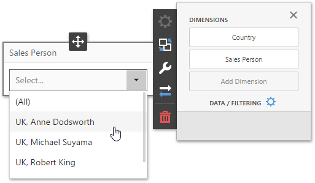
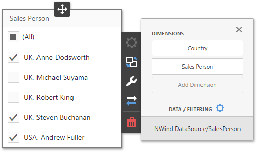
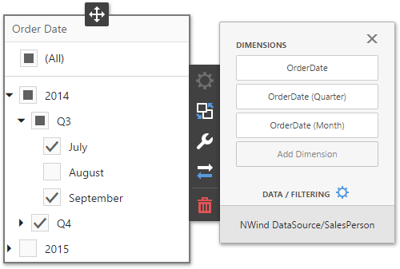

# Providing Data
The Web Dashboard allows you to bind various dashboard items to data in a consistent manner, the only difference being the data sections that these dashboard items comprise. To learn more about common binding concepts, see the [Binding Dashboard Items to Data](../../binding-dashboard-items-to-data.md) topic.

This topic describes how to bind **filter elements** to data using the Web Dashboard control.

## Binding Overview
All filter elements provide the **Dimensions** data section, which accepts dimensions used to provide filter values.

To bind the filter elements to data, click a placeholder contained in one of the available data sections and select the required data source field in the **Binding** section of the invoked [data item menu](../../ui-elements/data-item-menu.md).

To learn about the specifics of binding various filter elements to data, see the table below.

| Dashboard Item | Data Sections | Description |
|---|---|---|
| **Combo Box** |  | The Combo Box filter element can contain several dimensions at the **Dimensions** data section. In this case , the drop-down list will contain combinations of dimension values. |
| **List Box** |  | The List Box filter element can contain several dimensions at the **Dimensions** data section. In this case, the list will contain combinations of dimension values. |
| **Tree View** |  | The Tree View filter element can contain several dimensions at the **Dimensions** data section. In this case, dimension values are displayed in a hierarchical way. This can be the set of dimensions with different group intervals (e.g., Year/Quarter/Month) or the set of related dimensions (e.g., geographical data such as continents/countries/cities). |