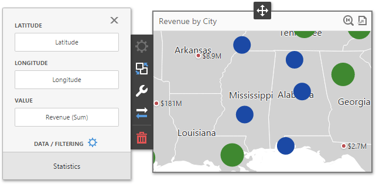

# Providing Data
The **Web Dashboard** allows you to bind various dashboard items to data in a virtually uniform manner. To learn more, see the [Binding Dashboard Items to Data](../../../binding-dashboard-items-to-data.md) topic.

The only difference is in the data sections that the required dashboard item has. This topic describes how to bind the **Geo Point Map** dashboard item to data.

## Binding to Data in the Web Dashboard
The image below shows a sample Geo Point Map dashboard item that is bound to data.

To bind the Geo Point Map dashboard item to data, click the placeholder contained in one of the available data sections and select the required data source field in the **Binding** section of the invoked [data item menu](../../../ui-elements/data-item-menu.md).

The tables below list and describe the Geo Point Map's data sections.

| Section | Processed as | Description |
|---|---|---|
| **Lattitude** | Dimension | Accepts a dimension used to provide geographic latitude. |
| **Longitude** | Dimension | Accepts a dimension used to provide geographic longitude. |
| **Value** | Measure | Accepts values related to geographic points. These values are displayed within map callouts. |

The Geo Point Map allows you to add supplementary content to the tooltips to provide additional data.

| Section | Processed as | Description |
|---|---|---|
| **Tooltip Dimensions** | Dimension | Accepts dimensions allowing you to add supplementary content to the tooltips. |
| **Tooltip Measures** | Measure | Accepts measures allowing you to add summaries to the tooltips. |