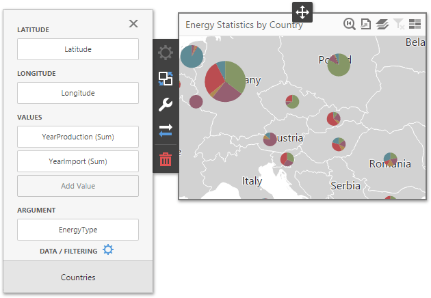

# Providing Data
The **Web Dashboard** allows you to bind various dashboard items to data in a virtually uniform manner. To learn more, see the [Binding Dashboard Items to Data](../../../binding-dashboard-items-to-data.md) topic.

The only difference is in the data sections that the required dashboard item has. This topic describes how to bind the **Pie Map** dashboard item to data.

## Binding to Data in the Web Dashboard
The image below shows a sample Pie Map dashboard item that is bound to data.

To bind the Pie Map dashboard item to data, click a placeholder contained in one of the available data sections and select the required data source field in the **Binding** section of the invoked [data item menu](../../../ui-elements/data-item-menu.md).

The tables below list and describe the Pie Map's data sections.

| Section | Processed as | Description |
|---|---|---|
| **Lattitude** | Dimension | Accepts a dimension used to provide geographic latitude. |
| **Longitude** | Dimension | Accepts a dimension used to provide geographic longitude. |
| **Values** | Measure | Accepts measures used to calculate pie values. |
| **Arguments** | Measure | Allows you to provide data for pie arguments. If you added a data item to the **Argument** section and several data items to the Values section, you can use the Values drop-down menu to switch between the provided values. To invoke the Values menu, click the  icon in the [dashboard item caption](../../../dashboard-layout/dashboard-item-caption.md). |

The Pie Map allows you to add supplementary content to tooltips to provide additional data.

| Section | Processed as | Description |
|---|---|---|
| **Tooltip Dimensions** | Dimension | Accepts dimensions allowing you to add supplementary content to tooltips. |
| **Tooltip Measures** | Measure | Accepts measures allowing you to add summaries to tooltips. |