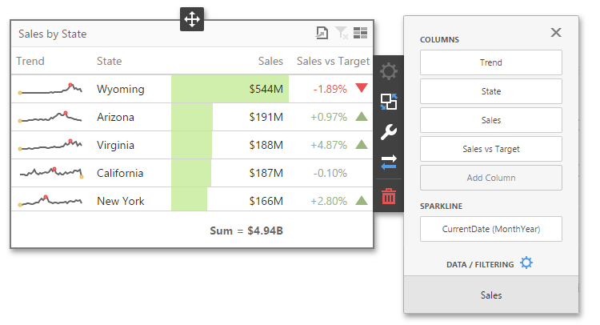

# Providing Data
The **Web Dashboard** allows you to bind various dashboard items to data in a virtually uniform manner. To learn more, see the [Binding Dashboard Items to Data](../../../../../dashboard-for-web/articles/web-dashboard-designer-mode/binding-dashboard-items-to-data.md) topic.

The only difference is in the data sections that the required dashboard item has. This topic describes how to bind a **Grid** dashboard item to data.

## Binding to Data in the Web Dashboard
The image below shows a sample Grid dashboard item that is bound to data.

To bind the Grid dashboard item to data, click a placeholder contained in one of the available data sections and select the required data source field in the **Binding** section of the invoked [data item menu](../../../../../dashboard-for-web/articles/web-dashboard-designer-mode/ui-elements/data-item-menu.md).

The table below lists and describes the Grid's data sections.

| Section | Processed as | Description |
|---|---|---|
| **Columns** | Dimension or Measure (depending on the selected column type) | Contains data items that provide values for grid columns. The data item menu allows you to select the [column type](../../../../../dashboard-for-web/articles/web-dashboard-designer-mode/designing-dashboard-items/grid/columns.md) and specify their options. |
| **Sparkline** | Dimension | Contains a data item that provides arguments for sparkline columns. To learn more, see [Columns](../../../../../dashboard-for-web/articles/web-dashboard-designer-mode/designing-dashboard-items/grid/columns.md). |