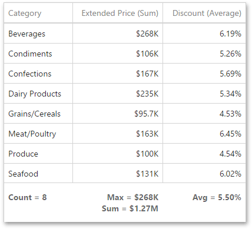
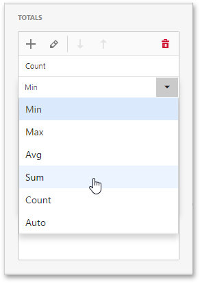
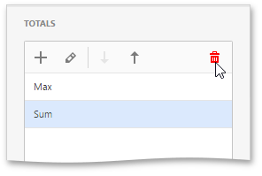

# Totals
The Grid dashboard item enables you to add a summary value (a **total**) calculated against displayed values of an individual column, and to show the result under this column. Note that you can add any number of totals for each column. For example, you can obtain the number of column records, average or maximum value, etc.

* [Totals Overview](#overview)
* [Create and Edit Totals](#create)

## <a name="overview"/>Totals Overview
You can use the following summary functions when creating totals.
* **Count** - The number of records.
* **Sum** - The sum of the values. 
	
	
* **Min** - The smallest value.
* **Max** - The largest value.
* **Average** - The average of the values.
	
	
* **Auto** - 
	The total is calculated using the type of [summary function](../../data-shaping/summarization.md) specified for the measure corresponding to the current Grid column. Note that in this case, the total is calculated based on values of the corresponding data field from the underlying data source. 
	
	> Note that the **Auto** type is not supported when the Grid is bound to the OLAP data source.

You can create totals using different sets of summary functions. This depends on the type of the data source field providing data for the target column.

> Note that the **Auto** type is available only for the [measure](columns.md) column.

## <a name="create"/>Create and Edit Totals
To create a total, open a [data item menu](../../ui-elements/data-item-menu.md) and go to the **Totals** section. Click "+" to add a new total.

To change the total type, open the drop down list and select the required type.

You can delete the required total by clicking the **Delete** button (the  icon).

