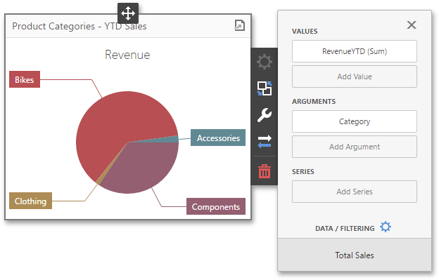

The **Web Dashboard** allows you to bind various dashboard items to data in a virtually uniform manner. To learn more, see the [Binding Dashboard Items to Data](../../../../../dashboard-for-web/articles/web-dashboard-designer-mode/binding-dashboard-items-to-data.md) topic.

The only difference is in the data sections that the required dashboard item has. This topic describes how to bind a **Pie** dashboard item to data.

## Binding to Data in the Web Dashboard
The image below shows a sample Pie dashboard item that is bound to data.

To bind the Pie dashboard item to data, click a placeholder contained in one of the available data sections and select the required data source field in the **Binding** section of the invoked [data item menu](../../../../../dashboard-for-web/articles/web-dashboard-designer-mode/ui-elements/data-item-menu.md).

The table below lists and describes the Pie's data sections.

| Section | Processed as | Description |
|---|---|---|
| **Values** | Measure | Contains data items that define the share of pie segments. In case of negative measure values, Pie uses their absolute values. |
| **Arguments** | Dimension | Contains data items that provide values used to label pie segments. |
| **Series** | Dimension | Contains data items whose values are used to label pie charts. |