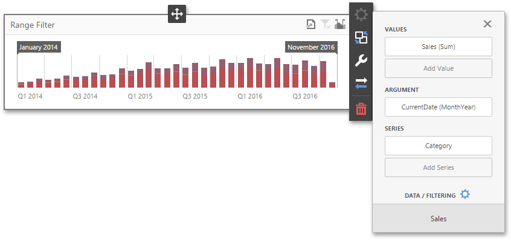

The **Web Dashboard** allows you to bind various dashboard items to data in a virtually uniform manner. To learn more, see the [Binding Dashboard Items to Data](../../../../../dashboard-for-web/articles/web-dashboard-designer-mode/binding-dashboard-items-to-data.md) topic.

The only difference is in the data sections that the required dashboard item has. This topic describes how to bind a **Range Filter** dashboard item to data.

## Binding to Data in the Web Dashboard
The image below shows a sample Range Filter dashboard item that is bound to data.

To bind the Range Filter dashboard item to data, click a placeholder contained in one of the available data sections and select the required data source field in the **Binding** section of the invoked [data item menu](../../../../../dashboard-for-web/articles/web-dashboard-designer-mode/ui-elements/data-item-menu.md).

The table below lists and describes the Range Filter's data sections.

| Section | Processed as | Description |
|---|---|---|
| **Values** | Measure | Contains data items against which the Y-coordinates of data points are calculated. |
| **Arguments** | Dimension | Contains data items that provide values displayed along the horizontal axis of the Range Filter. Data filtering is performed based on these values. Note that the **Custom Periods** section in the **Options** menu allows you to create [predefined ranges](../../../../../dashboard-for-web/articles/web-dashboard-designer-mode/designing-dashboard-items/range-filter/predefined-periods.md) used to select the required date-time interval. |
| **Series** | Dimension | Contains data items whose values are used to create chart series. |