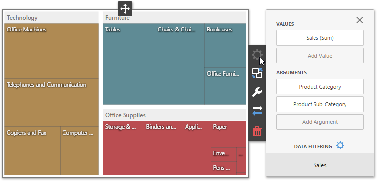

# Providing Data
The **Web Dashboard** allows you to bind various dashboard items to data in a virtually uniform manner. To learn more, see the [Binding Dashboard Items to Data](../../../../../dashboard-for-web/articles/web-dashboard-designer-mode/binding-dashboard-items-to-data.md) topic.

The only difference is in the data sections that the required dashboard item has. This topic describes how to bind a **Treemap** dashboard item to data.

## Binding to Data in the Web Dashboard
The image below shows a sample Treemap dashboard item that is bound to data.

To bind the Treemap dashboard item to data, click a placeholder contained in one of the available data sections and select the required data source field in the **Binding** section of the invoked [data item menu](../../../../../dashboard-for-web/articles/web-dashboard-designer-mode/ui-elements/data-item-menu.md).

The table below lists and describes the Treemap's data sections.

| Section | Processed as | Description |
|---|---|---|
| **Values** | Measure | Contains data items that provide numeric data. You can fill several data item containers in the Values section and use the **Values** drop-down menu to switch between the provided values. To invoke the Values menu, click the  icon in the [dashboard item caption](../../../../../dashboard-for-web/articles/web-dashboard-designer-mode/dashboard-layout/dashboard-item-caption.md). |
| **Arguments** | Dimension | Contains data items that provide discrete categorical data. If the Arguments section contains several dimensions, you can [group](../../../../../dashboard-for-web/articles/web-dashboard-designer-mode/designing-dashboard-items/treemap/grouping.md) child tiles by values of the parent dimension. |