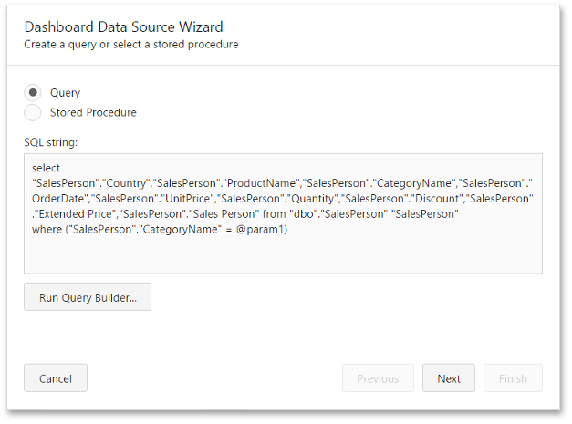

The [Query Builder](../../../../../dashboard-for-web/articles/web-dashboard-designer-mode/providing-data/working-with-sql-data-sources/query-builder.md) allows you to [filter queries](../../../../../dashboard-for-web/articles/web-dashboard-designer-mode/providing-data/working-with-sql-data-sources/filter-queries.md) using parameters. To specify settings of an added query parameter after creating a query, click **Next** in the [Dashboard Data Source Wizard](../../../../../dashboard-for-web/articles/web-dashboard-designer-mode/providing-data/working-with-sql-data-sources/dashboard-data-source-wizard.md) dialog.

On the next page, select the query parameter you have created to configure it.

The following settings are available.
* **Name** - Specifies a parameter's name.
* **Type** - Specifies the parameter's type.
* **Value** - Specifies the parameter's value. If the parameter type is set to _Expression_, invoke the **Expression Editor** dialog using the ellipsis button and specify the required expression. For example, you can use an existing [dashboard parameter](../../../../../dashboard-for-web/articles/web-dashboard-designer-mode/data-analysis/dashboard-parameters.md) to pass to the SQL query.

Use **Add** to add a new parameter and the **Remove** button to remove the selected query parameter.

Then, click **Finish** to complete query modifications.