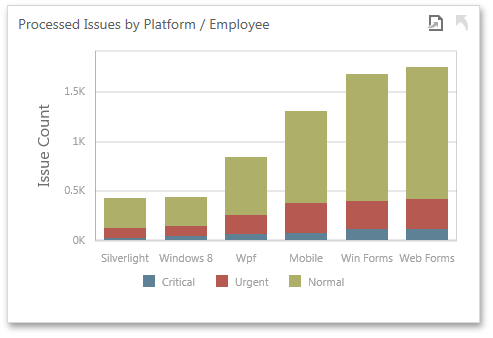
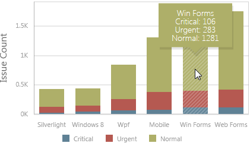

# Data Presentation Basics
The **Chart** dashboard item presents data visually using different types of series.

A series represents a grouping of related data points. The most important characteristic of a series is its type, which determines a particular visual representation of data.

The Chart dashboard item includes the following series types.
*  A **Bar** series displays data as sets of rectangular bars with lengths proportional to the values that they represent.
*  **Point** and **Line** series display data as standalone points or points joined by a line.
*  An **Area** series displays data by a line that joins points, and the shaded area between the line and the argument axis.
*  A **Range** series is the area between two simple series displayed as a shaded area, or bars that stretch from a point in one series to the corresponding point in another series.
*  A **Weighted** series displays data using a third dimension, expressed by a bubble's size.
*  **Financial** series are useful in analyzing stock and bond prices, as well as the behavior of commodities.

## Tooltip
The Chart dashboard item can display a tooltip that shows information on a hovered series point.

