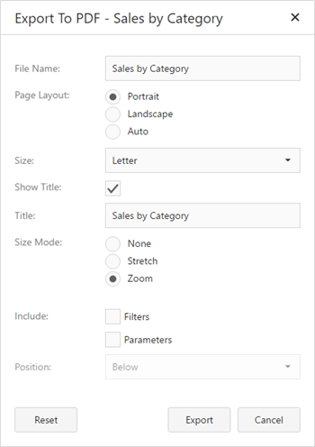
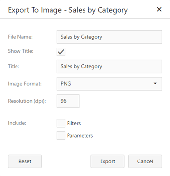
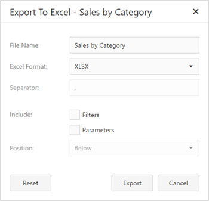

The Web Dashboard allows you to export individual dashboard items or the entire dashboard. To learn more about exporting concepts common to all dashboard items, see the [Exporting](../../../../../dashboard-for-web/articles/web-dashboard-viewer-mode/exporting.md) topic.

This topic describes the specifics of exporting a **Treemap** dashboard item.
* [Export To PDF](#export-to-pdf)
* [Export To Image](#export-to-image)
* [Export To Excel](#export-to-excel)

## <a name="export-to-pdf"/>Export To PDF
The following options are available when exporting the Treemap dashboard item to a PDF.

* **File Name** - Specifies the name of the exported PDF.
* **Page Layout** - Specifies the page orientation used to export a dashboard item.
* **Size** - Specifies the standard paper size.
* **Show Title** - Specifies whether or not to apply the dashboard item caption to the exported document title.
* **Title** -Specifies the title of the exported document.
* **Size Mode** - Specifies the export size mode for the Treemap dashboard item.
* **Include | Filters** - Allows you to include master filter values to the exported document.
* **Include | Parameters** - Allows you to include parameter values to the exported document.
* **Position** - Specifies the position of the master filter and parameter values in the exported document. You can select between _Below_ and _Separate Page_.

Specify the required options in this dialog and click the **Export** button to export the Treemap dashboard item. To reset changes to the default values, click the **Reset** button.

## <a name="export-to-image"/>Export To Image
All data-bound dashboard items provide the same set of options when exporting them to an Image format. The following options are available:

* **File Name** - Specifies the name of the exported Image file.
* **Show Title** - Specifies whether or not to apply the dashboard item caption to the exported document title.
* **Title** - Specifies the title of the exported document.
* **Image Format** - Specifies the image format in which the dashboard item is exported.
* **Resolution (dpi)** - Specifies the resolution (in dpi) used to export a dashboard item.
* **Include | Filters** - Allows you to include master filter values to the exported document.
* **Include | Parameters** - Allows you to include parameter values to the exported document.

Specify the required options in this dialog and click the **Export** button to export the dashboard item. To reset changes to the default values, click the **Reset** button.

## <a name="export-to-excel"/>Export To Excel
Data visualized within all data-bound dashboard items can be exported to the required Excel format. The following options are available:

* **File Name** - Specifies the name of the exported Excel file.
* **Excel Format** - Specifies the Excel format in which the dashboard item is exported. You can use the XLSX, XLS or CSV formats.
* **Separator** - Specifies the string used to separate values in the exported CSV document.
* **Include | Filters** - Allows you to include master filter values to the exported document.
* **Include | Parameters** - Allows you to include parameter values to the exported document.
* **Position** - Specifies the position of the master filter and parameter values in the exported document. You can select between _Below_ and _Separate Sheet_.

Specify the required options in this dialog and click the **Export** button to export the dashboard item. To reset changes to the default values, click the **Reset** button.