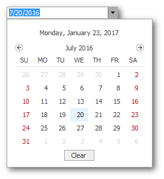
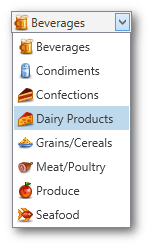

## Select and Deselect Editor's Contents
To select all text within an editor, you can invoke the [Editor Context Menu](../../../interface-elements-for-desktop/articles/editors/editor-context-menu.md) and choose **Select All**. To select a part of the edit value, click on a position where the selection should start, drag the pointer to the end position and then release the mouse button.

Additionally, the following keyboard shortcuts allow you to manage selections.

| Shortcut | Description |
|---|---|
| CTRL+A or F2 | Selects all within an editor. |
| SHIFT+ARROW | Extends or shrinks the selection by one character. |
| CTRL+SHIFT+ARROW | Extends or shrinks the selection by one word. |

## Clipboard Operations
Clipboard operations are supported for editors that support caret moving. 

To copy selected text into the clipboard, do one of the following.
* Press CTRL+C or CTRL+INSERT.
* Open the [Editor Context Menu](../../../interface-elements-for-desktop/articles/editors/editor-context-menu.md) and select **Copy**.

To paste text from the clipboard, do one of the following.
* Press CTRL+V or SHIFT+INSERT.
* Open the [Editor Context Menu](../../../interface-elements-for-desktop/articles/editors/editor-context-menu.md) and select **Paste**.

To cut text from an editor into the clipboard, do one of the following.
* Press CTRL+X or SHIFT+DELETE.
* Open the [Editor Context Menu](../../../interface-elements-for-desktop/articles/editors/editor-context-menu.md) and select **Cut**.

## Delete Selected Text
To delete the selected text within an editor, do one of the following.
* Press DELETE or BACKSPACE.
* Open the [Editor Context Menu](../../../interface-elements-for-desktop/articles/editors/editor-context-menu.md) and select **Delete**.

## Undo
To undo the last text editing operation, do one of the following.
* Press CTRL+Z.
* Open the [Editor Context Menu](../../../interface-elements-for-desktop/articles/editors/editor-context-menu.md) and select **Undo**.

> After you've undone an operation, you can return to the previous edit value by executing the Undo command once again.

## Change Date/Time Values

You can edit these values without opening the dropdown calendar. Position the caret at the portion of a date/time value that needs to be changed.  To increment the value, press the UP ARROW. To decrement the value, press the DOWN ARROW. Or use the mouse wheel.

## Change Numeric Values

To increment a value, press the UP ARROW. To decrement the value, press the DOWN ARROW. Alternatively, rotate the wheel button.

## Change Binary Values

Click a check box or a toggle switch to change its value.

## Change Values of Editors That Display Items in the Dropdown

To select the previous value, press the UP ARROW. To select the next value, press the DOWN ARROW. Alternatively, rotate the wheel button.

To learn how to open and close dropdown windows, see [Working with Dropdown Editors](../../../interface-elements-for-desktop/articles/editors/working-with-dropdown-editors.md).

## Navigate hyperlinks

Hover the mouse pointer over a hyperlink to display a tooltip. 
Click a hyperlink to navigate it.

## Edit Images
To copy, cut, paste, load and save images in image editors, select the required command from the image menu. To access the image menu, do one of the following.
* Right click the image editor.
* Hover the mouse pointer over the image editor.

To learn more about image editors, see [Image Editor](../../../interface-elements-for-desktop/articles/editors/image-editor.md).

