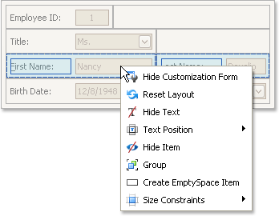
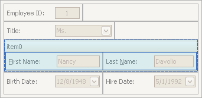

# Work with Interface Element Groups
To perform layout customization, first invoke [Customization Mode](../../../../interface-elements-for-desktop/articles/layout-manager/layout-customization/start-layout-customization.md). After customization has been completed, [exit](../../../../interface-elements-for-desktop/articles/layout-manager/layout-customization/finish-layout-customization.md) customization mode.

## Combine Layout Items into Groups
1. Select a layout item that is to be added to a new group by clicking it.
	
	You can select multiple items simultaneously by clicking them while holding the SHIFT key down.
2. Right-click any of the selected layout items and select **Group** from the context menu:
	
	
	
	Note that only adjacent selected layout items can be combined into a group, and only if the region occupied by them forms a rectangle. Otherwise, the **Group** command is not available when right-clicking the selection.

As a result, a new group is created:

You can subsequently rename the group and customize its contents using drag-and-drop and context menus if required.

## Rename Groups
Do the following:
1. Right-click the group's caption and select **Rename**:
	
	
2. Type a new name and press ENTER.

## Change Group Content
To customize the layout of controls within a group, use drag-and-drop.

## Ungroup Elements
To ungroup elements, right-click the group's caption and select **Ungroup**:

