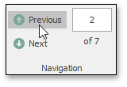
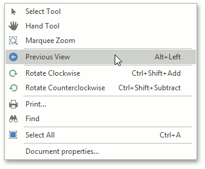
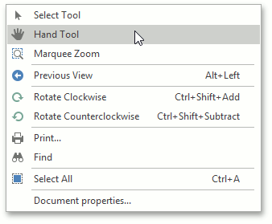
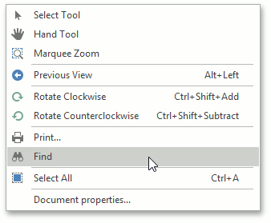
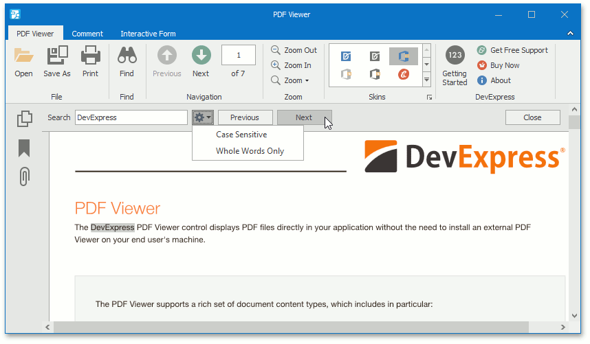

# Navigate and View a Document
This document provides information on using the PDF Viewer user interface to navigate through the document content.

The topic consists of the following sections.
* [Navigate Between Pages](#navigation)
* [Navigate Between Viewes](#views)
* [Search for a Specific Text](#search)

## <a name="navigation"/>Navigate Between Pages
To navigate between pages, use one of the following.
* The scrollbars.
* **Previous** and **Next** navigation buttons.
	
	
	
	These buttons allow you to switch to the previous or next page of a document.
* The **Pager** that is used to show the current page number and the total number of pages in a document.
	
	
	
	To change the page number in the **Pager**, type a new page number and press **ENTER**.
* The **Bookmarks** panel located on the Navigation pane.
	
	
	
	To jump to a topic, click a bookmark.
* The **Page Thumbnails** panel located on the Navigation pane.
	
	
	
	To jump to the page in a document, click a page thumbnail in the **Page Thumbnails** panel.

## <a name="views"/>Navigate Between Views
To change the page view, use one of the following.
* Right-click this document and select the **Previous View**  or **Next View**  item in the invoked context menu.
	
	
	
	or...
	
	press **Alt**+**Left** or **Alt**+**Right**.
* Move a page with the **Hand** tool.
	
	The **Hand** tool enables you to scroll content by dragging the document instead of using scrollbars.
	
	To activate the **Hand** tool, right-click the viewing document and select the **Hand Tool**  item in the context menu.
	
	
	
	Then, after you click the document's page, the mouse pointer is changed from  to . Drag the mouse pointer to scroll the document.
* Use zoom toolbars to change page magnification. For more details, see the **Adjust the Document View** topic.

## <a name="search"/>Search for a Specific Text
To search for a specific text within a document, click the **Find** button on the toolbar.

To invoke the **Find** dialog using the context menu, right-click the document and select the **Find**>  item in the context menu.

In the **Find** dialog, type the text you want to search for and specify the following settings (if required):

* The **Case Sensitive** option specifies whether to ignore the letter case when searching text.

* The **Whole Words Only** option only considers whole words when searching text. For example, it does not find the word **types** when you search for **type**.

* To start searching, click the **Next** button in the **Find** dialog, or press the **ENTER** key when the PDF Viewer shows the **Find** dialog.

The PDF Viewer stops searching when it finds the first occurrence of the search text, highlights the occurrence and navigates to the highlighted text.

To search for the next match, click  the **Next** button in the **Find** dialog, or press the **ENTER** key again when the PDF Viewer shows the **Find** dialog. 

To go to the previous match, click the **Previous** button.

The PDF Viewer shows the following message when it finds the final occurrence of the search text or there were no results that match the search text.

