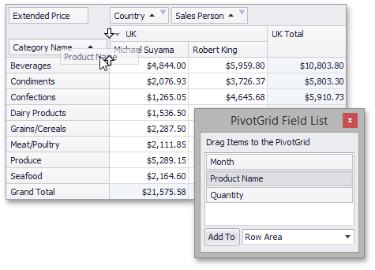
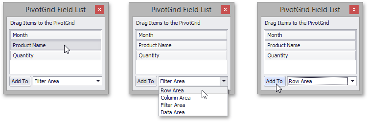
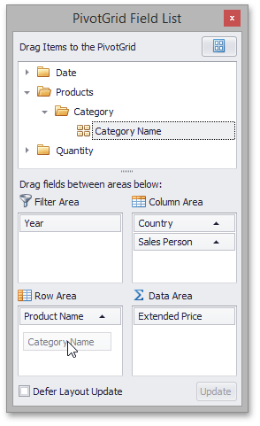

To display hidden fields, use a simple or advanced Field List  (to learn more about Field Lists, see [Field List Overview](../../../../interface-elements-for-desktop/articles/pivot-table/field-list-overview.md)).

&nbsp;&nbsp;

First, invoke a Field List. For information on how to do this, see [Invoke a Field List](../../../../interface-elements-for-desktop/articles/pivot-table/field-list/invoke-a-field-list.md).

To display a hidden field, drag-and-drop the field from the Field List onto the required area of Pivot Table. This works for both simple and advanced Field Lists.

If you are using a simple Field List, you can display the required field as follows.
1. Click the required field in the Field List.
2. In the drop-down combo box, select a Pivot Table area within which this field should be displayed.
3. Click the **Add To** button.

If you are using an advanced Field List, you can display a hidden field by dragging its header from the hidden fields section to the section corresponding to the required Pivot Table area.

