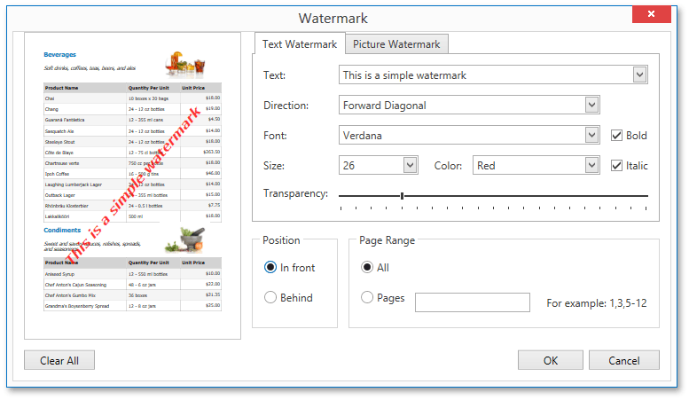
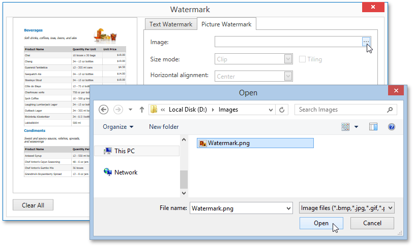

# Changing a Watermark
With the Print Preview, you can add a text watermark in a document, or turn a picture into a document's background. It is also possible to use both textual and image watermarks simultaneously.

To invoke the **Watermark** dialog, click the **Watermark**  button on the toolbar.

## Adding a Text Watermark
To add a text watermark, open the **Text Watermark** tab. Input the required watermark's text or choose one of the provided options in the **Text** drop-down list. Then, define other text properties, such as direction, color, font, size, transparency, etc.

## Adding an Image Watermark
To add a picture watermark, switch to the **Picture Watermark** tab. To load the image to be used as a watermark, click the ellipsis button for the **Image** property. In the invoked dialog, select the file containing the image that you wish to load and click **Open**.

Then, you can specify the picture's properties, such as the size mode, alignment, transparency, etc.

## Specifying Watermark Properties
At the bottom of the **Watermark** dialog, you can select a watermark position behind or in front of the document, and specify the page range in which the watermark will be printed.

These settings are in effect both for text and image watermarks.

## Removing a Watermark
To remove watermarks from a document, click **Clear All** in the **Watermark** dialog. Then, click **OK** to save changes and close the dialog.