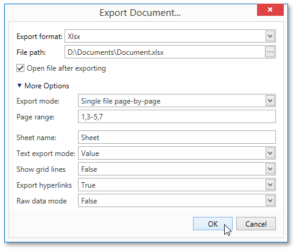

When [exporting a document](../../../../../interface-elements-for-desktop/articles/print-preview/print-preview-for-wpf/exporting/exporting.md), you can define the following XLSX-specific exporting options.

* **Export mode**
	
	Specifies how a document is exported to XLSX. The following modes are available.
	* The **Single file** mode allows export of a document to a single file, without dividing it into pages.
	* The **Single file page-by-page** mode allows export of a document to a single file, divided into pages. In this mode, the **Page range** option is available.
	* The **Different files** mode allows export of a document to multiple files, one for each document page. In this mode, the **Page range** option is available.
* **Page range**
	
	Specifies a range of pages which will be included in the resulting file. To separate page numbers, use commas. To set page ranges, use hyphens.
* **Sheet name**
	
	Specifies the name of the sheet in the created XLSX file.
* **Text export mode**
	
	Specifies whether value formatting should be converted to the native XLSX format string (if it is possible), or embedded into cell values as plain text.
* **Show grid lines**
	
	Specifies whether grid lines should be visible in the resulting XLSX file.
* **Export hyperlinks**
	
	Specifies whether to include hyperlinks into the resulting file.
* **Raw data mode**
	
	Specifies whether to enable the raw data export mode. In this mode, only a document's actual data is exported to XLSX, ignoring non-relevant elements, such as images, graphic content, font and appearance settings.