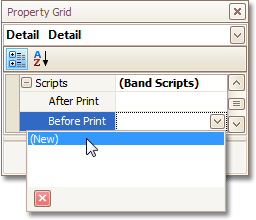
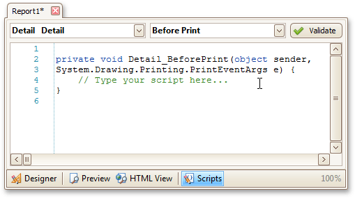
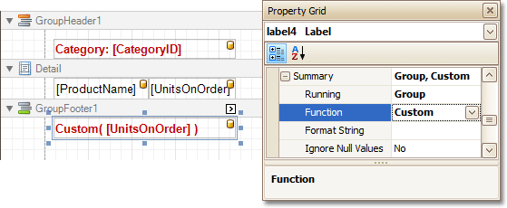
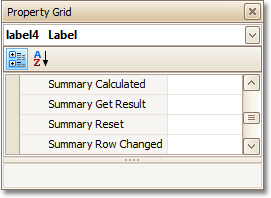
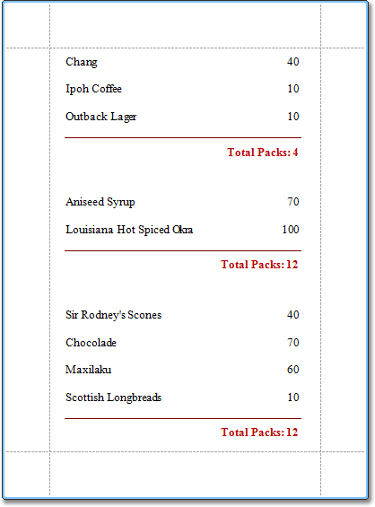

This document describes the basic principles of _scripting_, which can be performed by handling the events of a report, and its [bands](../../../../../../interface-elements-for-desktop/articles/report-designer/report-designer-for-winforms/report-designer-reference/report-bands.md) and [controls](../../../../../../interface-elements-for-desktop/articles/report-designer/report-designer-for-winforms/report-designer-reference/report-controls.md).

This documents consists of the following sections.
* [Scripting Overview](#overview)
* [Scripting Specifics](#specifics)
* [Example: Custom Summary](#example)

## <a name="overview"/>Scripting Overview
_Scripts_ are program commands, placed within the _event handlers_ of the required report elements. And, when the corresponding event occurs (e.g. a mouse click), the script code runs.

You can write _scripts_ for a report or any of its elements (bands and controls), to be executed when the report is being [previewed, printed or exported](../../../../../../interface-elements-for-desktop/articles/report-designer/report-designer-for-winforms/preview-print-and-export-reports.md).

Although when in the Report Designer, virtually any task can be accomplished without scripting ([Conditionally Change a Control's Appearance](../../../../../../interface-elements-for-desktop/articles/report-designer/report-designer-for-winforms/create-reports/styles-and-conditional-formatting/conditionally-change-a-control's-appearance.md), [Conditionally Change a Label's Text](../../../../../../interface-elements-for-desktop/articles/report-designer/report-designer-for-winforms/create-reports/styles-and-conditional-formatting/conditionally-change-a-label's-text.md) and [Conditionally Hide Bands](../../../../../../interface-elements-for-desktop/articles/report-designer/report-designer-for-winforms/create-reports/styles-and-conditional-formatting/conditionally-hide-bands.md)), scripting is made available to extend the standard functionality as far as may be required. And, scripting is the only way to calculate _custom summaries_ (this is detailed in the [last section of this document](#example)).

Every report element has a set of script events, which are individual for each element's type. For example, the events of the [Detail](../../../../../../interface-elements-for-desktop/articles/report-designer/report-designer-for-winforms/report-designer-reference/report-bands/detail-band.md) band are shown in the following image.



After you click (New) for an event (e.g. the **Before Print**, which is the most used), the [Scripts Tab](../../../../../../interface-elements-for-desktop/articles/report-designer/report-designer-for-winforms/report-designer-reference/report-designer-ui/scripts-tab.md) is switched on, where you can manage and edit all the report's scripts.



In this tab, for a selected event, a script template is auto-added, in the language specified via the **Script Language** property of the report.

You can verify that your report's scripts are valid, by clicking **Validate**. The validation result is then displayed in the [Scripts Errors Panel](../../../../../../interface-elements-for-desktop/articles/report-designer/report-designer-for-winforms/report-designer-reference/report-designer-ui/scripts-errors-panel.md).


Note that scripts are saved to a file along with the report's layout (for details on this, refer to [Back Up the Current Layout Before Modifying It](../../../../../../interface-elements-for-desktop/articles/report-designer/report-designer-for-winforms/report-editing-basics/back-up-the-current-layout-before-modifying-it.md)).

## <a name="specifics"/>Scripting Specifics
1. **Scripting language**
	
	The report scripts may be written in one of the following languages that the .NET framework supports - **C#**, **Visual Basic** and **J#**. Since J# is not installed with the framework installation, by default, make sure it is present before writing code in it. The scripting language is specified via the **Script Language** property of the [Report](../../../../../../interface-elements-for-desktop/articles/report-designer/report-designer-for-winforms/report-designer-reference/report-settings.md) object. It is set to C#, by default.
2. **Scripting scope**
	
	Script execution is performed in the following way:
	
	The report engine generates a temporary class in memory. The names of the variables are defined by the **Name** properties of the controls and objects they represent. When the script is preprocessed, its namespace directives are cut from the script code and added to the namespace, where the temporary class is defined.
	
	After preprocessing, all scripts are placed in the code of the temporary class. Then, the resulting class is compiled in memory, and its methods are called when events occur.
	  
	
	Scripting offers many advantages: you can declare classes (they will become inner classes), variables, methods, etc. A variable declared in one script is accessible in another script, because it is, in fact, a variable of the temporary class.
3. **Reference External Assemblies**
	
	The **Script References** property of the **Report** object specifies the full paths (including the file names) to the assemblies that are referenced in the scripts used in a report. These paths should be specified for all the assemblies that are included in scripts via the **using** (C#), **Imports** (Visual Basic) or **import** (J#) directives.
	
	> Usually, you don't need include any assembles, because most standard assemblies that you may require in scripts are already referenced by the Report Designer.

## <a name="example"/>Example: Custom Summary
In this example, we will display the total number of  product unit packs in a group.

To perform this, execute steps similar to the ones described in [Add Totals to a Report](../../../../../../interface-elements-for-desktop/articles/report-designer/report-designer-for-winforms/report-editing-basics/add-totals-to-a-report.md), except that for the summary field, you should set the **Function** property to **Custom**.



Then, the additional events are added to the label's **Scripts** property.



You can handle these events in the following way.

**csharp**

```csharp

// Declare a summary and a pack.
double totalUnits = 0;
double pack = 15;

private void OnSummaryReset(object sender, System.EventArgs e) {
    // Reset the result each time a group is printed.
    totalUnits = 0;
}

private void OnSummaryRowChanged(object sender, System.EventArgs e) {
    // Calculate a summary.
    totalUnits += Convert.ToDouble(GetCurrentColumnValue("UnitsOnOrder"));
}

private void OnSummaryGetResult(object sender, 
DevExpress.XtraReports.UI.SummaryGetResultEventArgs e) {
    // Round the result, so that a pack will be taken into account 
    // even if it contains only one unit.
    e.Result = Math.Ceiling(totalUnits / pack);
    e.Handled = true;
}

```

**vb**

```vb

' Declare a summary and a pack.
Private totalUnits As Double = 0
Private pack As Double = 15

Private Sub OnSummaryReset(ByVal sender As Object, ByVal e As System.EventArgs)
    ' Reset the result each time a group is printed.
    totalUnits = 0
End Sub

Private Sub OnSummaryRowChanged(ByVal sender As Object, ByVal e As System.EventArgs)
    ' Calculate a summary.
    totalUnits += Convert.ToDouble(GetCurrentColumnValue("UnitsOnOrder"))
End Sub

Private Sub OnSummaryGetResult(ByVal sender As Object,  _ 
ByVal e As DevExpress.XtraReports.UI.SummaryGetResultEventArgs)
    ' Round the result, so that a pack will be taken into account 
    ' even if it contains only one unit.
    e.Result = Math.Ceiling(totalUnits / pack)
    e.Handled = True
End Sub

```

Finally, switch to the [Preview Tab](../../../../../../interface-elements-for-desktop/articles/report-designer/report-designer-for-winforms/report-designer-reference/report-designer-ui/preview-tab.md), and view the result.

