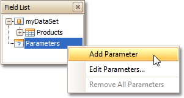
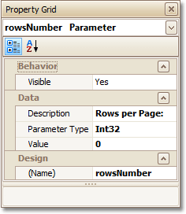
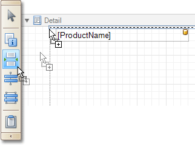
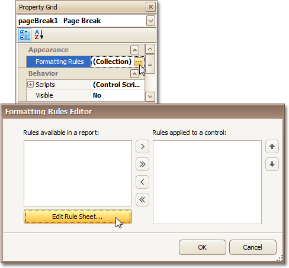
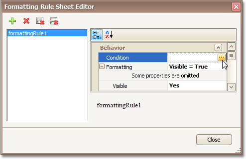
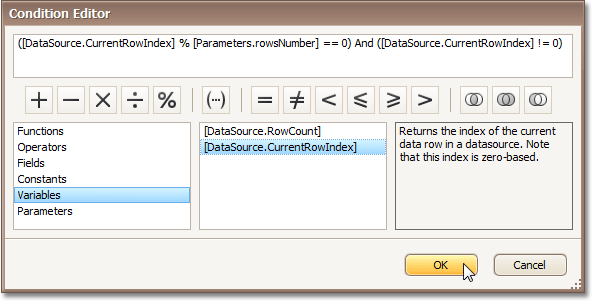
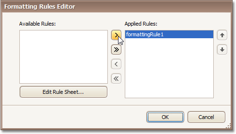
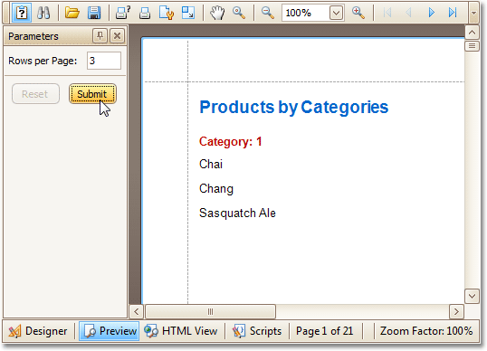

This tutorial demonstrates how to define how many records should be displayed at each page in a report's Print Preview. Note that no [scripts](../../../../../../interface-elements-for-desktop/articles/report-designer/report-designer-for-winforms/create-reports/miscellaneous/handle-events-via-scripts.md) are required to accomplish this task.

To demonstrate this feature, we'll use a report, similar to the one created in the following tutorial: [Change or Apply Data Grouping to a Report](../../../../../../interface-elements-for-desktop/articles/report-designer/report-designer-for-winforms/report-editing-basics/change-or-apply-data-grouping-to-a-report.md).

To limit the number of records per page, do the following.
1. To add a [parameter](../../../../../../interface-elements-for-desktop/articles/report-designer/report-designer-for-winforms/create-reports/report-types/parameterized-report.md) to the report, in the [Field List](../../../../../../interface-elements-for-desktop/articles/report-designer/report-designer-for-winforms/report-designer-reference/report-designer-ui/field-list.md), right-click the **Parameters** section, and in the invoked menu, choose **Add Parameter**.
	
	
2. Select the parameter, and in the [Property Grid](../../../../../../interface-elements-for-desktop/articles/report-designer/report-designer-for-winforms/report-designer-reference/report-designer-ui/property-grid.md), set its **Description** to **Rows per Page:**, **Parameter Type** to **Int32** and **(Name)** to **rowsNumber**.
	
	
3. From the [Toolbox](../../../../../../interface-elements-for-desktop/articles/report-designer/report-designer-for-winforms/report-designer-reference/report-designer-ui/control-toolbox.md), drop the [Page Break](../../../../../../interface-elements-for-desktop/articles/report-designer/report-designer-for-winforms/report-designer-reference/report-controls/page-break.md) control onto the top of the report's [Detail](../../../../../../interface-elements-for-desktop/articles/report-designer/report-designer-for-winforms/report-designer-reference/report-bands/detail-band.md) band.
	
	
4. Select the Page Break, and set its **Visible** property to **No**. Then, click the ellipsis button for its **Formatting Rules** property, and in the invoked **Formatting Rules Editor**, click the **Edit Rule Sheet...** button.
	
	
5. Now, in the invoked **Formatting Rule Sheet Editor**, click , to create a new formatting rule. Set its **Visible** property to **Yes**, and click the ellipsis button for its **Condition** property.
	
	
6. In the invoked **Condition Editor**, define a logical expression for the rule, (e.g. **([DataSource.CurrentRowIndex] % [Parameters.rowsNumber] == 0) And ([DataSource.CurrentRowIndex] != 0)**).
	
	
	
	To save the changes and close the dialog, click **OK**.
	
	Then, click **Close**, to quit the **Formatting Rule Sheet Editor**, as well.
7. Now, back in the **Formatting Rules Editor**, move the created rule to the list of applied rules on the right, using the arrow buttons in the middle of the dialog.
	
	
	
	To save the changes and close the editor, click **OK**.

The report is now ready. Switch to the [Preview Tab](../../../../../../interface-elements-for-desktop/articles/report-designer/report-designer-for-winforms/report-designer-reference/report-designer-ui/preview-tab.md), and in the **Parameters** section, define the required value and click **Submit**.

Note that while in this example, the number of rows is specified each time the report is being previewed, you can make this number secure, by setting the parameter's **Value** option to the desired value, and then setting the report's **Request Parameters** option to **No**.