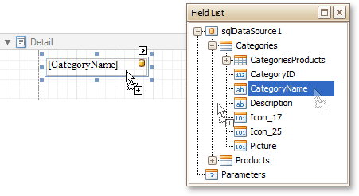
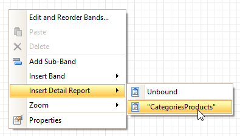
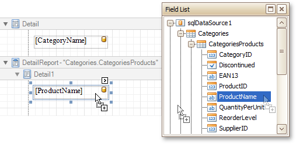
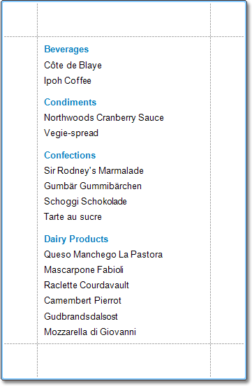

This tutorial describes how to create a master-detail report with hierarchically linked data using the [Detail Report band](../../../../../../interface-elements-for-desktop/articles/report-designer/report-designer-for-winforms/report-designer-reference/report-bands/detail-report-band-for-master-detail-reports.md). For an alternative approach, refer to [Master-Detail Report (Subreports)](../../../../../../interface-elements-for-desktop/articles/report-designer/report-designer-for-winforms/create-reports/report-types/master-detail-report-(subreports).md).

To accomplish this task, do the following.
1. [Create a new report](../../../../../../interface-elements-for-desktop/articles/report-designer/report-designer-for-winforms/create-reports/basic-operations/create-a-new-report.md).
2. Bind the report to a required data source and provide it with a master-detail relationship as demonstrated in the [Bind a Report to a Database](../../../../../../interface-elements-for-desktop/articles/report-designer/report-designer-for-winforms/create-reports/binding-a-report-to-data/bind-a-report-to-a-database.md) topic.
3. To display data in the master report, drop the required data fields from the [Field List](../../../../../../interface-elements-for-desktop/articles/report-designer/report-designer-for-winforms/report-designer-reference/report-designer-ui/field-list.md) onto the report's [Detail Band](../../../../../../interface-elements-for-desktop/articles/report-designer/report-designer-for-winforms/report-designer-reference/report-bands/detail-band.md).
	
	
	
	For the master report to be generated properly, the report's **Data Member** should be set to the master query. To manually specify the data member, click the report's smart tag, and in the invoked actions list, expand the drop-down list for the **Data Member** property and select the master query.
4. Then, add the [Detail Report band](../../../../../../interface-elements-for-desktop/articles/report-designer/report-designer-for-winforms/report-designer-reference/report-bands/detail-report-band-for-master-detail-reports.md). To do this, right-click anywhere on the report's surface, and in the invoked [context menu](../../../../../../interface-elements-for-desktop/articles/report-designer/report-designer-for-winforms/report-designer-reference/report-designer-ui/context-menu.md), select **Insert Detail Report**. When the report's data source contains a data relationship, it is displayed in the context menu.
	
	
5. After that, drop the required data fields from the Field List onto the detail report band. For the detail report to be generated correctly, take fields from the master-detail relationship node.
	
	

The master-detail report is now ready. Switch to the [Preview Tab](../../../../../../interface-elements-for-desktop/articles/report-designer/report-designer-for-winforms/report-designer-reference/report-designer-ui/preview-tab.md) and view the result.

