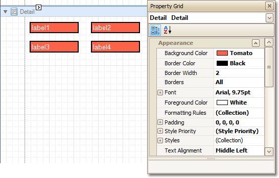
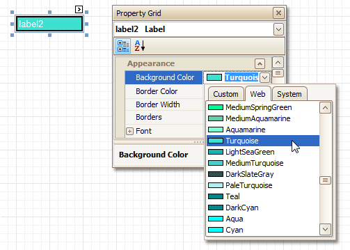
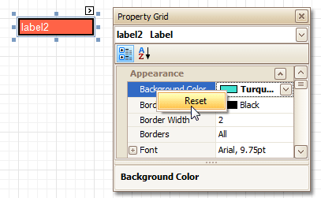
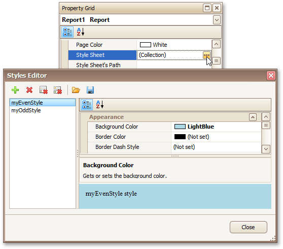
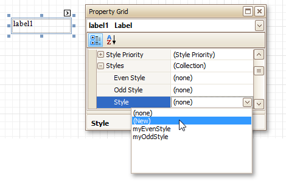
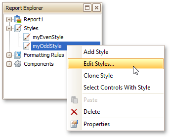
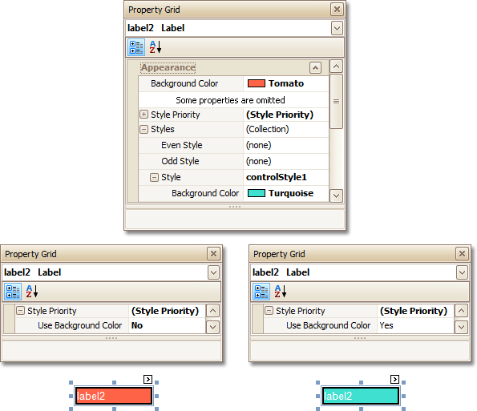

# Understanding Style Concepts
This document describes how you can provide a professional look to your reports by effectively adjusting the appearance of its elements.

This document consists of the following sections.
* [Appearance Properties](#properties)
* [Visual Styles](#styles)
* [Styles Priority](#priority)

<a name="properties"/>

## Appearance Properties
In the Report Designer, a [report](../../../../../../interface-elements-for-desktop/articles/report-designer/report-designer-for-winforms/report-designer-reference/report-settings.md) and each of its elements ([bands](../../../../../../interface-elements-for-desktop/articles/report-designer/report-designer-for-winforms/report-designer-reference/report-bands.md) and [controls](../../../../../../interface-elements-for-desktop/articles/report-designer/report-designer-for-winforms/report-designer-reference/report-controls.md)) has a complete set of appearance options (such as **Background Color**, **Borders**, **Font**, **Foreground Color**, **Text Alignment**, etc.). By default, these properties aren't specified, meaning that their real values are obtained from a control's (or band's) _parent_, which is the report itself. So, the appearance specified for a report is distributed to all its child elements. Similarly, the appearance of a band is translated to the controls it contains.

In turn, a control's appearance can be adjusted independently from its parent.

To reset a value assigned to a control's appearance property, you can right-click this property in the [Property Grid](../../../../../../interface-elements-for-desktop/articles/report-designer/report-designer-for-winforms/report-designer-reference/report-designer-ui/property-grid.md), and in the invoked menu, click **Reset**. As a result, the control will be restored to the appearance of its parent.

<a name="styles"/>

## Visual Styles
In addition to the capability to specify appearance property values for every control and bands, you can create comprehensive global _styles_ (which are stored in the report's _style sheet_), and then assign them to individual report elements. There are two ways to store a report's style sheets.
* Save them to external files (with a REPSS extension), and then load them to a report using its **Style Sheet Path** property. This approach is described in the [Store and Restore Style Sheets](../../../../../../interface-elements-for-desktop/articles/report-designer/report-designer-for-winforms/create-reports/styles-and-conditional-formatting/store-and-restore-style-sheets.md) document.
* Store the styles within the report, so that they can be easily accessed using its **Style Sheet** property and can be modified, if required.

Click the ellipsis button for the **Style Sheet** property to invoke the **Styles Editor**, which allows you to manage a report's style sheets, customize them, save to a file and load from it.

> Note that if styles contained in a style sheet loaded using the **Style Sheet Path** property have the same names as styles already contained in a report, the latter are overridden.

To assign a particular style to a control, invoke the drop-down list for its **Style** property. Then, select one of the styles stored in a report's sheet collection or select **(New)** to create a new style sheet.

Note that if a style is assigned to a band, it is applied to all controls that the band contains.

You can also use the [Report Explorer](../../../../../../interface-elements-for-desktop/articles/report-designer/report-designer-for-winforms/report-designer-reference/report-designer-ui/report-explorer.md) to access the style collection. Commands of the context menu allow you to add, edit, clone or delete a style.

To apply style to a report element, drag it from the Report Explorer onto the required report element.

<a name="priority"/>

## Styles Priority
A style defines the same appearance properties that are defined by a control's (or band's) appearance properties. When both styles and individual appearance settings are assigned to an element, you can control the priority of their differing options using an element's **Style Priority** property.

By default, most of the **Style Priority**'s options (**Use Background Color**, **Use Border Color**, etc.) are set to **Yes**. This means that if any style is assigned to a control, its properties will have a higher priority than the appearance properties of this element or its parent. You can assign a higher priority to an element's appearance property by disabling the corresponding **Use*** property.

The following image demonstrates how the **Style Priority** property works.

The same principles are applied to the _odd-even styles_ feature, which allows you to alternate the appearance of consecutive data rows in your report. For details on this, refer to [Use Odd and Even Styles](../../../../../../interface-elements-for-desktop/articles/report-designer/report-designer-for-winforms/create-reports/styles-and-conditional-formatting/use-odd-and-even-styles.md).

> When [conditional formatting](../../../../../../interface-elements-for-desktop/articles/report-designer/report-designer-for-winforms/create-reports/styles-and-conditional-formatting/conditionally-change-a-controls-appearance.md) is applied to an element, its appearance definition has the highest priority.