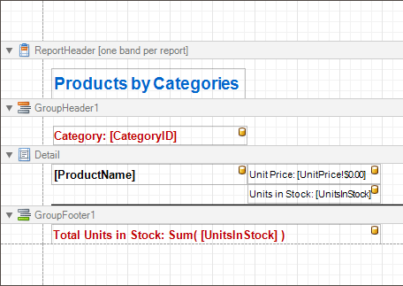
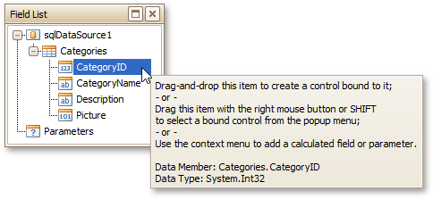
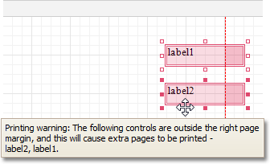
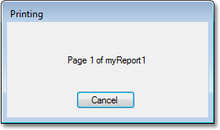

# Report Settings
This document details settings that affect the entire report.

A **Report** is the main object in the Report Designer, as it's the document being edited. A typical report is shown in the following image (as it looks in the [Designer Tab](../../../../../interface-elements-for-desktop/articles/report-designer/report-designer-for-winforms/report-designer-reference/report-designer-ui/designer-tab.md)).

While the main report's properties can be accessed via the report's [Smart Tag](../../../../../interface-elements-for-desktop/articles/report-designer/report-designer-for-winforms/report-designer-reference/report-designer-ui/smart-tag.md), the complete settings list is available in the [Property Grid](../../../../../interface-elements-for-desktop/articles/report-designer/report-designer-for-winforms/report-designer-reference/report-designer-ui/property-grid.md), where all the report's properties are divided into the following groups.

## Appearance
* **Background Color**
	
	Specifies the background color of report elements. This option is also available in the [Formatting Toolbar](../../../../../interface-elements-for-desktop/articles/report-designer/report-designer-for-winforms/report-designer-reference/report-designer-ui/formatting-toolbar.md) ().
* **Borders**, **Border Color**, **Border Dash Style** and **Border Width**
	
	Specify border settings for report elements.
* **Font**
	
	Specifies the font settings for report elements. Some of these settings are available in the [Formatting Toolbar](../../../../../interface-elements-for-desktop/articles/report-designer/report-designer-for-winforms/report-designer-reference/report-designer-ui/formatting-toolbar.md).
* **Foreground Color**
	
	Specifies the text color for report elements. This option is also available in the [Formatting Toolbar](../../../../../interface-elements-for-desktop/articles/report-designer/report-designer-for-winforms/report-designer-reference/report-designer-ui/formatting-toolbar.md) ().
* **Formatting Rule Sheet**
	
	Invokes the Formatting Rule Sheet Editor, allowing you to manage and customize formatting rules, which can then be defined for a report's bands and controls. To learn more on this, refer to [Conditionally Change a Control's Appearance](../../../../../interface-elements-for-desktop/articles/report-designer/report-designer-for-winforms/create-reports/styles-and-conditional-formatting/conditionally-change-a-control's-appearance.md).
* **Formatting Rules**
	
	Invokes the Formatting Rules Editor, allowing you to choose which rules should be applied to the report during report generation, and define the precedence of the applied rules. To learn more on this, refer to [Conditionally Change a Control's Appearance](../../../../../interface-elements-for-desktop/articles/report-designer/report-designer-for-winforms/create-reports/styles-and-conditional-formatting/conditionally-change-a-control's-appearance.md).
* **Padding**
	
	Specifies indent values used to render the contents of a report's controls.
* **Page Color**
	
	Specifies the fill color for report pages. This color may be [changed later](../../../../../interface-elements-for-desktop/articles/print-preview/print-preview-for-winforms/watermark-and-background/change-watermark-and-background-settings-in-print-preview.md) in a report's Print Preview.
* **Style Sheet**
	
	Allows you to invoke the Styles Editor, which is intended to manage and customize a report's style sheets. To learn more on this, refer to [Store and Restore Style Sheets](../../../../../interface-elements-for-desktop/articles/report-designer/report-designer-for-winforms/create-reports/styles-and-conditional-formatting/store-and-restore-style-sheets.md).
* **Style Sheet's Path**
	
	Allows you to define a path to the style sheet contained in a report style sheet file (.REPSS). To learn more on this, refer to [Store and Restore Style Sheets](../../../../../interface-elements-for-desktop/articles/report-designer/report-designer-for-winforms/create-reports/styles-and-conditional-formatting/store-and-restore-style-sheets.md).
* **Text Alignment**
	
	Allows you to change the alignment of a report controls' text. This option is also available in the [Formatting Toolbar](../../../../../interface-elements-for-desktop/articles/report-designer/report-designer-for-winforms/report-designer-reference/report-designer-ui/formatting-toolbar.md).
* **Watermark**
	
	Allows you to customize a report's watermark options. For more information about this, refer to [Create or Modify Watermarks of a Report](../../../../../interface-elements-for-desktop/articles/report-designer/report-designer-for-winforms/report-editing-basics/create-or-modify-watermarks-of-a-report.md).

## Behavior
* **Display Name**
	
	Specifies the name of the report, which is displayed in its Design Panel tab.
	
	
* **Export Options**
	
	Allows you to set the export options for each file type (PDF, XLS, TXT, etc.). These options vary with the file type.
* **Horizontal Content Splitting**
	
	Specifies whether report controls outside the bottom page margin should be split across pages, or moved in their entirety to the next page.This option is useful for the [cross-tab reports](../../../../../interface-elements-for-desktop/articles/report-designer/report-designer-for-winforms/create-reports/report-types/cross-tab-report.md) creation.
* **Measure Units**
	
	Allows you to [choose units of measurement](../../../../../interface-elements-for-desktop/articles/report-designer/report-designer-for-winforms/create-reports/basic-operations/change-measurement-units-of-a-report.md) for a report (one hundredth of an inch or a tenth of a millimeter).
* **Script Language**
	
	Allows you to choose the programming language to be used in [scripting](../../../../../interface-elements-for-desktop/articles/report-designer/report-designer-for-winforms/create-reports/miscellaneous/handle-events-via-scripts.md) (C#, Visual Basic or J#).
* **Script References**
	
	Allows you to manage the collection of strings that represent the paths to the assemblies used by the [scripts](../../../../../interface-elements-for-desktop/articles/report-designer/report-designer-for-winforms/create-reports/miscellaneous/handle-events-via-scripts.md) in a report.
* **Scripts**
	
	This property contains events which you can handle with the required scripts. For more information on scripting, refer to [Handle Events via Scripts](../../../../../interface-elements-for-desktop/articles/report-designer/report-designer-for-winforms/create-reports/miscellaneous/handle-events-via-scripts.md).
* **Show Margin Lines in Preview**
	
	The page margin lines are dotted lines shown on the currently selected page in the  report's preview. Use this property to change the visibility of these lines.
* **Vertical Content Splitting**
	
	Allows you to choose whether report controls outside the right page margin should be split across pages, or moved in their entirety to the next page. This option is useful for the [cross-tab reports](../../../../../interface-elements-for-desktop/articles/report-designer/report-designer-for-winforms/create-reports/report-types/cross-tab-report.md) creation.
* **Visible**
	
	Specifies whether a report should be created in print preview.

## Data
* **Calculated Fields**
	
	Allows you to access a report's [calculated fields](../../../../../interface-elements-for-desktop/articles/report-designer/report-designer-for-winforms/report-editing-basics/add-calculated-fields-to-a-report.md) collection.
* **Data Adapter**
	
	Determines a report's data adapter used to populate the report's data source.
* **Data Member**
	
	Determines a specific list in a report's Data Source, for which the Report Designer objects display data. To learn more about this, refer to [Binding a Report to Data](../../../../../interface-elements-for-desktop/articles/report-designer/report-designer-for-winforms/create-reports/binding-a-report-to-data.md).
	
	> Usually, it is not necessary to specify the Data Member property when binding a report to data. This property should only be set directly if the dataset contains more than one table.
* **Data Source**
	
	Determines a report's data source. To learn more about this, refer to [Binding a Report to Data](../../../../../interface-elements-for-desktop/articles/report-designer/report-designer-for-winforms/create-reports/binding-a-report-to-data.md).
* **Filter String**
	
	Allows you to invoke the Filter String Editor, which is intended to easily define a filtering condition for a report's data. For more information about this, refer to [Change or Apply Data Filtering to a Report](../../../../../interface-elements-for-desktop/articles/report-designer/report-designer-for-winforms/report-editing-basics/change-or-apply-data-filtering-to-a-report.md).
* **Tag**
	
	This property allows you to add some additional information to a report; for example its id, by which it can then be accessible via [scripts](../../../../../interface-elements-for-desktop/articles/report-designer/report-designer-for-winforms/create-reports/miscellaneous/handle-events-via-scripts.md).
* **XML Data Path**
	
	Allows you to define a path to data contained in an external XML file. The data contained in the file will then be used as a report's data source.

## Design
* **(Name)**
	
	Determines a report's name, by which it can be accessed in the [Report Explorer](../../../../../interface-elements-for-desktop/articles/report-designer/report-designer-for-winforms/report-designer-reference/report-designer-ui/report-explorer.md), [Property Grid](../../../../../interface-elements-for-desktop/articles/report-designer/report-designer-for-winforms/report-designer-reference/report-designer-ui/property-grid.md) or via [scripts](../../../../../interface-elements-for-desktop/articles/report-designer/report-designer-for-winforms/create-reports/miscellaneous/handle-events-via-scripts.md).
* **Data Source's Schema**
	
	Allows you to load an XML/XSD file, containing the schema of a report's data source.
* **Designer Options**
	
	Contains the following options.
	* **Show Designer's Hints**
		
		The designer hints are intended to provide tooltips, both describing the purpose of certain report elements for inexperienced users, and describing the reasons and solutions for possible export or printing warnings. By using this property, these hints can be turned on or off.
		
		
	* **Show Export Warnings**
		
		The export warnings appear when report controls are overlapped, indicating that a report layout may be incorrect when exporting to certain table-based formats (such as XLS, HTML or RTF).
		
		
	* **Show Printing Warnings**
		
		The printing warnings are intended to notify you that some of a report's controls are placed outside the right page margin, so that the report contains unnecessary pages.
		
		
* **Draw the Grid**
	
	Determines whether to draw the [Snap Grid](../../../../../interface-elements-for-desktop/articles/report-designer/report-designer-for-winforms/create-reports/basic-operations/controls-positioning.md) when a report is being designed.
* **Draw the Watermark**
	
	Determines whether to draw a watermark at design time.
* **Snap Grid Size**
	
	Determines the size of the [Snap Grid](../../../../../interface-elements-for-desktop/articles/report-designer/report-designer-for-winforms/create-reports/basic-operations/controls-positioning.md)'s cells.
* **Snapping Mode**
	
	Specifies the mode in which report elements are [snapped](../../../../../interface-elements-for-desktop/articles/report-designer/report-designer-for-winforms/create-reports/basic-operations/controls-positioning.md) to each other when they are resized or being relocated.

## Navigation
* **Bookmark**
	
	Allows you to define how a report is named in the document map when the [report bookmarks](../../../../../interface-elements-for-desktop/articles/report-designer/report-designer-for-winforms/create-reports/report-navigation-and-interactivity-/add-bookmarks.md) are implemented. By default, it is synchronized with the report's Name property.
* **Bookmark Duplicate Suppress**
	
	Specifies whether or not to suppress duplicated bookmarks in a final document.

## Page Settings
* **Landscape**
	
	Determines whether the page orientation is Landscape (when set to Yes) or Portrait (when set to No).
* **Margins**
	
	Determines the width of a report's margins (measured in [report units](../../../../../interface-elements-for-desktop/articles/report-designer/report-designer-for-winforms/create-reports/basic-operations/change-measurement-units-of-a-report.md)).
	
	> Note that the report's Margins.Top and Margins.Bottom properties are tied to the Height property of the [Page Margin Bands](../../../../../interface-elements-for-desktop/articles/report-designer/report-designer-for-winforms/report-designer-reference/report-bands/page-margin-bands.md). So,  changing these properties' values will cause changing the appropriate bands' Height value as well, and vice versa.
* **Page Height**
	
	Specifies page height, in [report units](../../../../../interface-elements-for-desktop/articles/report-designer/report-designer-for-winforms/create-reports/basic-operations/change-measurement-units-of-a-report.md). This property can only be set if the Paper Kind property is set to Custom.
* **Page Width**
	
	Specifies page width, in [report units](../../../../../interface-elements-for-desktop/articles/report-designer/report-designer-for-winforms/create-reports/basic-operations/change-measurement-units-of-a-report.md). This property can only be set if the Paper Kind property is set to Custom.
* **Paper Kind**
	
	Determines the type of paper for a report. Setting this property to any value different from Custom will prevent the Page Height, Page Width and Paper Name properties from being customized.
	
	> If the Paper Kind property is set to Custom, then the printer paper will be selected according to the Paper Name property's value. In this case, it's also necessary to set the Page Width and Page Height properties to the corresponding values of the paper selected.
* **Paper Name**
	
	Determines the name of the custom paper used in the printer that will print the document.
	
	The Paper Name property's value is in effect only when the Paper Kind property is set to Custom. If the printer on which a document is printed doesn't support the paper type specified by the Paper Name property's value, then it will default to the Letter paper size. In this case, it's also necessary to set the Page Width and Page Height properties to the corresponding values of the selected paper.
* **Printer Name**
	
	Determines the name of the printer to use when printing a report. Note that the specified printer should be installed on the machine.
* **Roll Paper**
	
	Specifies whether the document is supposed to be printed on roll paper (i.e., as a single uninterrupted page).
* **Using Settings of the Default Printer**
	
	Specifies which of the default printer's settings should be used when printing a report.

## Parameters
* **Parameters**
	
	Allows you to access a report's [parameters](../../../../../interface-elements-for-desktop/articles/report-designer/report-designer-for-winforms/create-reports/report-types/parameterized-report.md) collection.
* **Request Parameters**
	
	Allows you to define whether it's required to request the values of a report's [parameters](../../../../../interface-elements-for-desktop/articles/report-designer/report-designer-for-winforms/create-reports/report-types/parameterized-report.md) when generating the report.

## Printing
* **Report Print Options**
	
	Specifies options that define how a report is printed in various circumstances.
	* **Blank Detail Count**
		
		Specifies how many times the empty Detail band is repeated before printing the regular data.
	* **Detail Count**
		
		Specifies how many times the Detail band should be printed when a datasource is defined for the report, and it is not empty.
	* **Detail Count at Design Time**
		
		Specifies how many times the Detail band is printed when a report is being previewed at design time.
	* **Detail Count when Data Source is Empty**
		
		Specifies how many times the Detail band should be printed when no datasource is defined for the report.
	* **Print when Data Source is Empty**
		
		Specifies whether or not a report should be printed if its datasource is empty.
* **Rigth to Left**
	
	Specifies the content orientation of a report's controls. Use this option to correctly render text written in right-to-left languages. Enabling this setting for a report will apply it to all report controls.
	
	The right-to-left layout is preserved when [exporting a report](../../../../../interface-elements-for-desktop/articles/print-preview/print-preview-for-winforms/exporting/exporting-from-print-preview.md) to any of the supported formats (e.g., PDF, Excel, or RTF).
* **Rigth to Left Layout**
	
	Specifies the position of controls within report bands. Enabling this property will also swap the page margins of a document (it will become impossible to place controls outside the right page margin). This property is in effect only when the **Right to Left** property is set to **Yes**.
* **Show Print Margin Warnings**
	
	Specifies whether an error message is shown when the page margins are set outside the printable area.
	
	
* **Show Print Status Dialog**
	
	Specifies whether a print status dialog is shown when a document is being printed.
	
	

## Structure
* **Bands**
	
	Allows you to invoke the Report Editor, intended to manage and customize a report's [bands](../../../../../interface-elements-for-desktop/articles/report-designer/report-designer-for-winforms/report-designer-reference/report-bands.md).