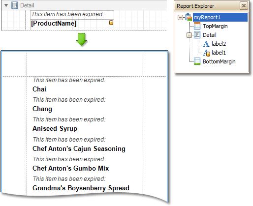
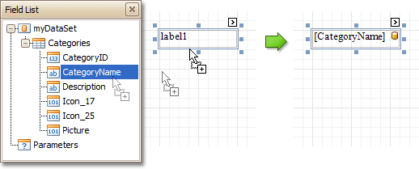
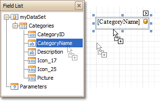
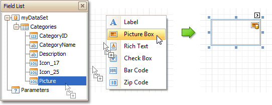
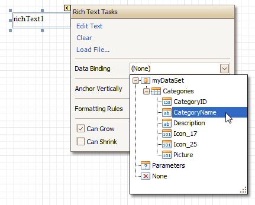
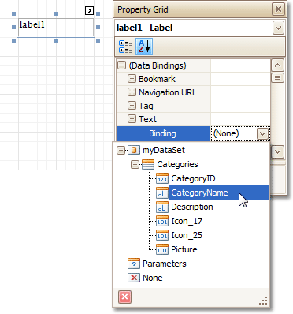

Report [controls](../../../../../interface-elements-for-desktop/articles/report-designer/report-designer-for-winforms/report-designer-reference/report-controls.md) can either display [static](../../../../../interface-elements-for-desktop/articles/report-designer/report-designer-for-winforms/report-editing-basics/add-or-modify-static-information-in-your-report.md) information or _dynamic_ data fetched from the [bound database](../../../../../interface-elements-for-desktop/articles/report-designer/report-designer-for-winforms/create-reports/binding-a-report-to-data.md).

Data-bound controls are indicated by a yellow database icon in their top-right corner, both in the [Design Panel](../../../../../interface-elements-for-desktop/articles/report-designer/report-designer-for-winforms/report-designer-reference/report-designer-ui/design-panel.md) and [Report Explorer](../../../../../interface-elements-for-desktop/articles/report-designer/report-designer-for-winforms/report-designer-reference/report-designer-ui/report-explorer.md).

To embed dynamic information to a report, if this information is contained in the report's data source, this can easily be done using one of the following approaches.
* [Using the Field List](#fieldlist)
* [Using the Smart Tag](#smarttag)
* [Using the Property Grid](#propertygrid)

After a control is bound to data, you may wish to employ additional features, which are listed in the final section of this document.
* [Special Capabilities](#special)

## <a name="fieldlist"/>Using the Field List
* To bind an existing report control to a data field, click the required field item in the [Field List](../../../../../interface-elements-for-desktop/articles/report-designer/report-designer-for-winforms/report-designer-reference/report-designer-ui/field-list.md), and then drag and drop it onto the control. The yellow database icon inside it will indicate that it's been successfully bound.
	
	
* To add a new data-bound control, simply drag the required data field from the Field List onto a report band. This will create a [Label](../../../../../interface-elements-for-desktop/articles/report-designer/report-designer-for-winforms/report-designer-reference/report-controls/label.md) bound to this data field.
	
* A more flexible way to create data-bound elements is to right-click a Field List item, and then drag and drop it onto a report. This will invoke the [Context Menu](../../../../../interface-elements-for-desktop/articles/report-designer/report-designer-for-winforms/report-designer-reference/report-designer-ui/context-menu.md), where you can choose which control should represent your data, and it will be automatically created and bound to the selected data field.
	
	

## <a name="smarttag"/>Using the Smart Tag
Click a control's [Smart Tag](../../../../../interface-elements-for-desktop/articles/report-designer/report-designer-for-winforms/report-designer-reference/report-designer-ui/smart-tag.md), and in the invoked actions list, expand the **Data Binding** drop-down list, and select the required data field.

## <a name="propertygrid"/>Using the Property Grid
Click a control to select it, and in the [Property Grid](../../../../../interface-elements-for-desktop/articles/report-designer/report-designer-for-winforms/report-designer-reference/report-designer-ui/property-grid.md), expand the **(Data Bindings)** branch that holds the bindable options. Specify a data field for the required attribute (e.g. **Text**).

## <a name="special"/>Special Capabilities
After a control is bound, you can apply formatting to its dynamic content (e.g. for it to be treated as currency, or date-time content). For details on this, refer to [Change Value Formatting of Report Elements](../../../../../interface-elements-for-desktop/articles/report-designer/report-designer-for-winforms/report-editing-basics/change-value-formatting-of-report-elements.md).

It is possible to make a control display a result of a summary function calculated across the data field to which it is bound. For details on this, refer to [Add Totals to a Report](../../../../../interface-elements-for-desktop/articles/report-designer/report-designer-for-winforms/report-editing-basics/add-totals-to-a-report.md).

Another noteworthy option is to combine both static and dynamic content within the same control (e.g. to append some text prefix or postfix to a value obtained from a database), or even bind a control to multiple data fields at one time. This is detailed in [Use Mail Merge in Report Elements](../../../../../interface-elements-for-desktop/articles/report-designer/report-designer-for-winforms/report-editing-basics/use-mail-merge-in-report-elements.md).

If it's required to perform some pre-calculations over the data field to which a control is bound, this can be done by creating a _calculated field_, and binding the control to it. This is detailed at [Add Calculated Fields to a Report](../../../../../interface-elements-for-desktop/articles/report-designer/report-designer-for-winforms/report-editing-basics/add-calculated-fields-to-a-report.md).

In turn, a calculated field may contain both dynamic and static _parameters_, which can be requested each time a report is being previewed. For more information, refer to [Add Parameters to a Report](../../../../../interface-elements-for-desktop/articles/report-designer/report-designer-for-winforms/report-editing-basics/add-parameters-to-a-report.md).