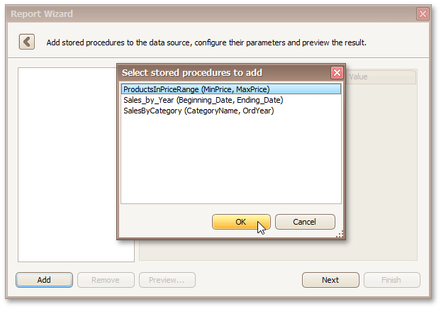
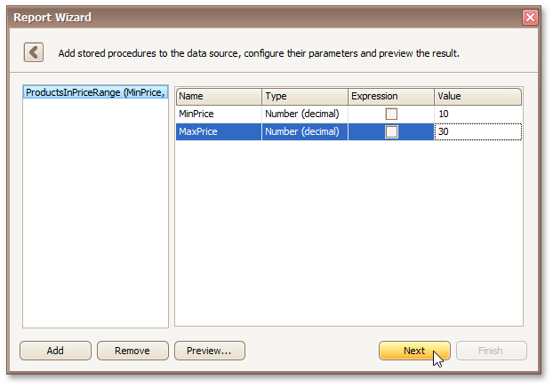

# Bind to a Stored Procedure
> This wizard step appears only if you're creating a new report from scratch. If you're modifying an existing report, this step will not appear and you will start with the [Choose Columns to Display in Your Report](../../../../../../../interface-elements-for-desktop/articles/report-designer/report-designer-for-winforms/report-wizard/data-bound-report/choose-columns-to-display-in-your-report.md) wizard page.

This wizard page allows you to add stored procedures to the data source, configure their parameters and preview the results of a stored procedure’s execution.

To bind to a stored procedure, do the following.
1. On the wizard page, click **Add**. Then, in the invoked window, select a required stored procedure and click **OK**.
	
	
2. Configure the parameters to be passed to the selected stored procedure. Make sure that the value of the passed parameter's **Type** property corresponds to the actual type of the stored procedure parameter.
	
	

Click **Next** to proceed to the next wizard page. If you have added more than one stored procedures on this page or if the current Entity Framework model additionally provides data tables, go to the [Select a Data Member](../../../../../../../interface-elements-for-desktop/articles/report-designer/report-designer-for-winforms/report-wizard/data-bound-report/connect-to-an-entity-framework-data-source/select-a-data-member.md) page. Otherwise, proceed to the [Choose Columns to Display in Your Report](../../../../../../../interface-elements-for-desktop/articles/report-designer/report-designer-for-winforms/report-wizard/data-bound-report/choose-columns-to-display-in-your-report.md) page.