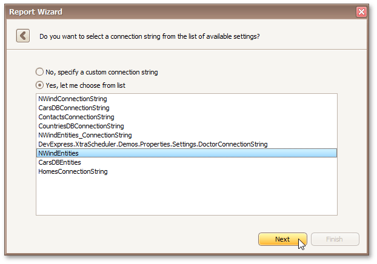

# Select the Connection String
> This wizard step appears only if you're creating a new report from scratch. If you're modifying an existing report, this step will not appear and you will start with the [Choose Columns to Display in Your Report](../../../../../../../interface-elements-for-desktop/articles/report-designer/report-designer-for-winforms/report-wizard/data-bound-report/choose-columns-to-display-in-your-report.md) wizard page.

On this page, you can specify a connection string using one of the following two options.
* Using an existing connection string. To do this, select **Yes, let me choose from list**. Next, select the required connection string from the list of the available connection strings.
* Specify a connection string manually. To do this, select **No, specify a custom connection string**.

Click **Next** to proceed to the next wizard page. If you select the first option, proceed to the [Specify a Connection String](../../../../../../../interface-elements-for-desktop/articles/report-designer/report-designer-for-winforms/report-wizard/data-bound-report/connect-to-a-database/specify-a-connection-string.md) page. If you choose one of the available connection strings, go to the [Bind to a Stored Procedure](../../../../../../../interface-elements-for-desktop/articles/report-designer/report-designer-for-winforms/report-wizard/data-bound-report/connect-to-an-entity-framework-data-source/bind-to-a-stored-procedure.md) or [Select a Data Member](../../../../../../../interface-elements-for-desktop/articles/report-designer/report-designer-for-winforms/report-wizard/data-bound-report/connect-to-an-entity-framework-data-source/select-a-data-member.md) page, depending on whether or not the current Entity Framework model provides stored procedures.