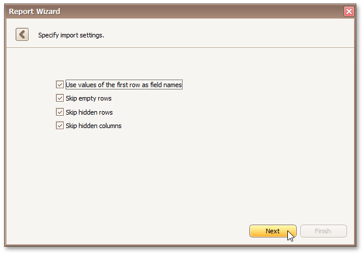
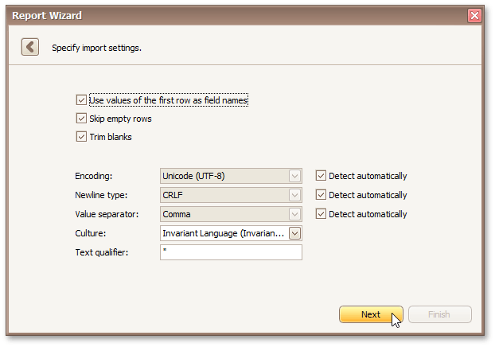

# Specify Import Settings
> This wizard step appears only if you're creating a new report from scratch. If you're modifying an existing report, this step will not appear and you will start with [Choose Columns to Display in Your Report](../../../../../../../interface-elements-for-desktop/articles/report-designer/report-designer-for-winforms/report-wizard/data-bound-report/choose-columns-to-display-in-your-report.md) wizard page.

On this wizard page, you can specify required import settings. This page provides access to different settings depending on whether you have selected an Excel Workbook or CSV file.
* [Import Settings for an Excel Workbook](#excelworkbook)
* [Import Settings for a CSV file](#csv)

<a name="excelworkbook"/>

## Import Settings for an Excel Workbook
The following settings are available if an Excel workbook has been selected.

* **Use values of the first rows as field names** - Specifies whether values of the first row should be imported as field names. If this option is disabled, values of the first row will be imported as data and field names will be generated automatically.
* **Skip empty rows** - Specifies whether or not to include empty rows to the resulting data source.
* **Skip hidden rows** - Specifies whether or not to include hidden rows to the resulting data source.
* **Skip hidden columns** - Specifies whether or not to include hidden columns to the resulting data source.

Click **Next** to proceed to the next wizard page: [Select a Worksheet, Table or Named Region](../../../../../../../interface-elements-for-desktop/articles/report-designer/report-designer-for-winforms/report-wizard/data-bound-report/connect-to-an-excel-data-source/select-a-worksheet-table-or-named-region.md).

<a name="csv"/>

## Import Settings for a CSV file
The following settings are available if a CSV file has been selected.

* **Use values of the first rows as field names** - Specifies whether or not values of the first row should be imported as field names. If this option is disabled, values of the first row will be imported as data and field names will be generated automatically.
* **Skip empty rows** - Specifies whether or not to include empty rows to the resulting data source.
* **Trim Blanks** - Specifies whether or not to delete all leading and trailing empty spaces from each value in the source CSV file.
* **Encoding** - Specifies the character encoding in the source CSV file. If the corresponding **Detect automatically** check box is enabled, this setting's value is automatically determined.
* **Newline type** - Specifies the line break type in the source CSV file. If the corresponding **Detect automatically** check box is enabled, this setting's value is automatically determined.
* **Value separator** - Specifies a character used to separate values in the source CSV file. If the corresponding **Detect automatically** check box is enabled, this setting's value is automatically determined.
* **Culture** - Specifies culture information used to import data from the source CSV file.
* **Text Qualifier** - Specifies the character that encloses values in the source CSV file.

Click **Next** to proceed to the next wizard page: [Choose Columns](../../../../../../../interface-elements-for-desktop/articles/report-designer/report-designer-for-winforms/report-wizard/data-bound-report/connect-to-an-excel-data-source/choose-columns.md).